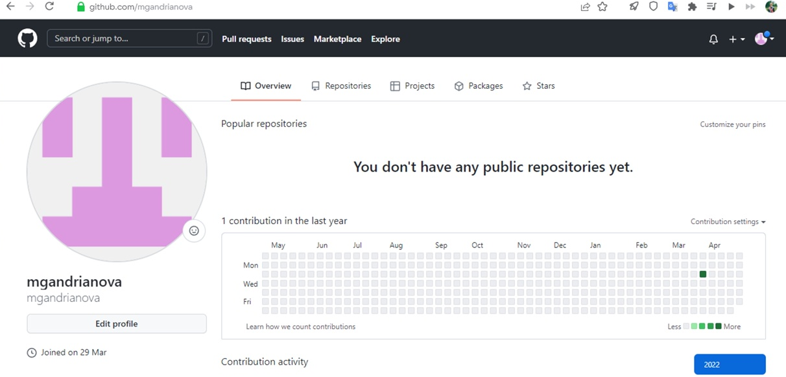

---
## Front matter
title: "Отчёт по лабораторной работе № 3"
subtitle: "*дисциплина: Операционные системы*"
author: "Андрианова Марина Георгиевна"

## Generic otions
lang: ru-RU
toc-title: "Содержание"

## Bibliography
bibliography: bib/cite.bib
csl: pandoc/csl/gost-r-7-0-5-2008-numeric.csl

## Pdf output format
toc: true # Table of contents
toc-depth: 2
lof: true # List of figures
lot: true # List of tables
fontsize: 12pt
linestretch: 1.5
papersize: a4
documentclass: scrreprt
## I18n polyglossia
polyglossia-lang:
  name: russian
  options:
	- spelling=modern
	- babelshorthands=true
polyglossia-otherlangs:
  name: english
## I18n babel
babel-lang: russian
babel-otherlangs: english
## Fonts
mainfont: PT Serif
romanfont: PT Serif
sansfont: PT Sans
monofont: PT Mono
mainfontoptions: Ligatures=TeX
romanfontoptions: Ligatures=TeX
sansfontoptions: Ligatures=TeX,Scale=MatchLowercase
monofontoptions: Scale=MatchLowercase,Scale=0.9
## Biblatex
biblatex: true
biblio-style: "gost-numeric"
biblatexoptions:
  - parentracker=true
  - backend=biber
  - hyperref=auto
  - language=auto
  - autolang=other*
  - citestyle=gost-numeric
## Pandoc-crossref LaTeX customization
figureTitle: "Рис."
tableTitle: "Таблица"
listingTitle: "Листинг"
lofTitle: "Список иллюстраций"
lotTitle: "Список таблиц"
lolTitle: "Листинги"
## Misc options
indent: true
header-includes:
  - \usepackage{indentfirst}
  - \usepackage{float} # keep figures where there are in the text
  - \floatplacement{figure}{H} # keep figures where there are in the text
---

#### **Цель работы**

Целью данной работы является изучение идеологии и применение средств контроля версий, а также освоение умений по работе с git.

#### **Ход работы**

1.Создаем учётную запись на https://github.com. Заполняем основные данные. Моя учетная запись называется mgandrianova. (Рис.1)


{ #fig:001 width=70% }

2.Настроим базовую конфигурацию git. Для этого зададим имя и email владельца репозитория(рис.2). Настроим utf-8 в выводе сообщений git. Настроим верификацию и подписание коммитов git: зададим имя начальной ветки(master), параметр(autocrlf), параметр safecrlf(рис.3).


{ #fig:002 width=70% }


{ #fig:003 width=70% }

3.Теперь надо сгенерировать два ключа ssh и gpg и вставить их в учетную запись github для того, чтобы привязать наш компьютер к github. Создадим ключ ssh с помощью команды (рис.4)
``` language
ssh-keygen -t rsa -b 4096
```
и скопируем его в буфер обмена  командой (рис.5).
``` language
cat ~/.ssh/id_rsa.pub | xclip -sel clip
```


{ #fig:004 width=70% }

{ #fig:005 width=70% }

Теперь вставим ключ в аккаунт на GitHub(рис.9).
Создадим ключ gpg командой 
``` language
gpg —full-generate-key 
```
и выбираем из предложенных опций варианты, которые указаны в лабораторной работе(рис.6). Выведем список ключей, чтобы скопировать отпечаток приватного ключа(рис.7).


{ #fig:006 width=70% }

{ #fig:007 width=70% }

Скопируем сгенерированный gpg ключ в буфер обмена(рис.8)


{ #fig:008 width=70% }

И вставим его на GitHub(рис. 9).


{ #fig:009 width=70% }

4.Используя введённый email, укажем Git применять его при подписи коммитов(рис.10).


{ #fig:010 width=70% }

5. Создадим путь, где будут храниться материалы к лабораторным работам и перейдём в последнюю папку(рис.11) и скачаем шаблон репозитория(рис.11) в папку.


{ #fig:011 width=70% }

Теперь создадим репозиторий на GitHub, где будут храниться только что созданные папки.
6. Перейдём в каталог курса(команда cd os-intro), удалим лишние файлы(команда  rm package.json) и создадим необходимые каталоги для дальнейшей работы (make COURSE=os-intro) (рис.12).


{ #fig:012 width=70% }

Теперь скопируем наш собственный репозиторий work в папку "Операционные системы", перенесём в него все файлы из папки os-intro и отправим на сервер, чтобы они также появились в репозитории на GitHub(рис. 13-16)


{ #fig:013 width=70% }

{ #fig:014 width=70% }

{ #fig:015 width=70% }

Смотрим репозиторий на сайте GitHub и убеждаемся, что мы сделали всё правильно(рис.16).


{ #fig:016 width=70% }


#### Выводы

Я изучила идеологию и применение контроля версий, также освоила умения по работе с git.

# Контрольные вопросы
1) Система контроля версий Git представляет собой набор программ командной строки. Доступ к ним можно получить из терминала посредством ввода команды git с различными опциями. Системы контроля версий (Version Control System, VCS) применяются при работе нескольких человек над одним проектом.
Система контроля версий (СКВ) -- программное обеспечение для облегчения работы с изменяющейся информацией. Система управления версиями позволяет хранить несколько версий одного и того же документа, при необходимости возвращаться к более ранним версиям, определять, кто и когда сделал то или иное изменение.
2) В классических системах контроля версий используется централизованная модель, предполагающая наличие единого репозитория для хранения файлов. Выполнение большинства функций по управлению версиями осуществляется специальным сервером. Участник проекта (пользователь) перед началом работы посредством определённых команд получает нужную ему версию файлов. После внесения изменений, пользователь размещает новую версию в хранилище. При этом предыдущие версии не удаляются из центрального хранилища и к ним можно вернуться в любой момент. Сервер может сохранять неполную версию изменённых файлов, а производить так называемую дельта-компрессию—сохранять только изменения между последовательными версиями, что позволяет уменьшить объём хранимых данных.
Системы контроля версий также могут обеспечивать дополнительные, более гибкие функциональные возможности. Например, они могут поддерживать работу с несколькими версиями одного файла, сохраняя общую историю изменений до точки ветвления версий и собственные истории изменений каждой ветви. Кроме того, обычно доступна информация о том, кто из участников, когда и какие изменения вносил. Обычно такого рода информация хранится в журнале изменений, доступ к которому можно ограничить.

3) Централизованные системы — это системы, которые используют архитектуру клиент / сервер, где один или несколько клиентских узлов напрямую подключены к центральному серверу. Пример - Wikipedia.
В децентрализованных системах каждый узел принимает свое собственное решение. Конечное поведение системы является совокупностью решений отдельных узлов. Пример — Bitcoin.
В классических системах контроля версий используется централизованная модель, предполагающая наличие единого репозитория для хранения файлов. Выполнение большинства функций по управлению версиями осуществляется специальным сервером.
4) Создадим локальный репозиторий. Сначала сделаем предварительную конфигурацию, указав имя и email владельца репозитория:
``` language
git config --global user.name"Имя Фамилия"
git config --global user.email"work@mail"
```
и настроив utf-8 в выводе сообщений git:
``` language
git config --global quotepath false
```
Для инициализации локального репозитория, расположенного, например, в каталоге ~/tutorial, необходимо ввести в командной строке:
``` language
cd
mkdir tutorial
cd tutorial
git init
```
5) Для последующей идентификации пользователя на сервере репозиториев необходимо сгенерировать пару ключей (приватный и открытый):
``` language
ssh-keygen -C "Имя Фамилия <work@mail>"
```
Ключи сохраняться в каталоге~/.ssh/.
Скопировав из локальной консоли ключ в буфер обмена:
``` language
cat ~/.ssh/id_rsa.pub | xclip -sel clip
```

вставляем ключ в появившееся на сайте поле.
6) У Git две основных задачи: первая — хранить информацию о всех изменениях в вашем коде, начиная с самой первой строчки, а вторая — обеспечение удобства командной работы над кодом.
7) Основные команды git:
Наиболее часто используемые команды git: – создание основного дерева репозитория :git init–получение обновлений (изменений) текущего дерева из центрального репозитория: git pull–отправка всех произведённых изменений локального дерева в центральный репозиторий:git push–просмотр списка изменённых файлов в текущей директории: git status–просмотр текущих изменения: git diff–сохранение текущих изменений:–добавить все изменённые и/или созданные файлы и/или каталоги: git add .–добавить конкретные изменённые и/или созданные файлы и/или каталоги: git add имена_файлов – удалить файл и/или каталог из индекса репозитория (при этом файл и/или каталог остаётся в локальной директории): git rm имена_файлов – сохранение добавленных изменений: – сохранить все добавленные изменения и все изменённые файлы: git commit -am 'Описание коммита'–сохранить добавленные изменения с внесением комментария через встроенный редактор: git commit–создание новой ветки, базирующейся на текущей: git checkout -b имя_ветки–переключение на некоторую ветку: git checkout имя_ветки (при переключении на ветку, которой ещё нет в локальном репозитории, она будет создана и связана с удалённой) – отправка изменений конкретной ветки в центральный репозиторий: git push origin имя_ветки–слияние ветки стекущим деревом:git merge --no-ff имя_ветки–удаление ветки: – удаление локальной уже слитой с основным деревом ветки:git branch -d имя_ветки–принудительное удаление локальной ветки: git branch -D имя_ветки–удаление ветки с центрального репозитория: git push origin :имя_ветки
8) Использования git при работе с локальными репозиториями (добавления текстового документа в локальный репозиторий):
``` language
git add hello.txt
git commit -am 'Новый файл’
```
9) Проблемы, которые решают ветки git:
    • нужно постоянно создавать архивы с рабочим кодом
    • сложно "переключаться" между архивами
    • сложно перетаскивать изменения между архивами
    • легко что-то напутать или потерять
10) Во время работы над проектом так или иначе могут создаваться файлы, которые не требуется добавлять в последствии в репозиторий. Например, временные файлы, создаваемые редакторами, или объектные файлы, создаваемые компиляторами. Можно прописать шаблоны игнорируемых при добавлении в репозиторий типов файлов в файл.gitignore с помощью сервисов. Для этого сначала нужно получить списоки меняющихся шаблонов: 
``` language
curl -L -s https://www.gitignore.io/api/list
```
Затем скачать шаблон, например, для C и C++
``` language
curl -L -s https://www.gitignore.io/api/c >> .gitignore
curl -L -s https://www.gitignore.io/api/c++ >> .gitignore
```


::: {#refs}
:::
