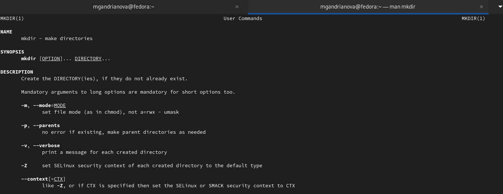
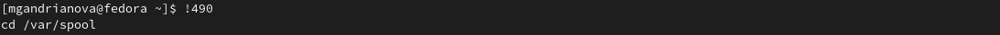
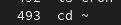

---
## Front matter
title: "Отчёт по лабораторной работе № 4"
subtitle: "*дисциплина:* Операционные системы"
author: "Андрианова Марина Георгиевна"

## Generic otions
lang: ru-RU
toc-title: "Содержание"

## Bibliography
bibliography: bib/cite.bib
csl: pandoc/csl/gost-r-7-0-5-2008-numeric.csl

## Pdf output format
toc: true # Table of contents
toc-depth: 2
lof: true # List of figures
lot: true # List of tables
fontsize: 12pt
linestretch: 1.5
papersize: a4
documentclass: scrreprt
## I18n polyglossia
polyglossia-lang:
  name: russian
  options:
	- spelling=modern
	- babelshorthands=true
polyglossia-otherlangs:
  name: english
## I18n babel
babel-lang: russian
babel-otherlangs: english
## Fonts
mainfont: PT Serif
romanfont: PT Serif
sansfont: PT Sans
monofont: PT Mono
mainfontoptions: Ligatures=TeX
romanfontoptions: Ligatures=TeX
sansfontoptions: Ligatures=TeX,Scale=MatchLowercase
monofontoptions: Scale=MatchLowercase,Scale=0.9
## Biblatex
biblatex: true
biblio-style: "gost-numeric"
biblatexoptions:
  - parentracker=true
  - backend=biber
  - hyperref=auto
  - language=auto
  - autolang=other*
  - citestyle=gost-numeric
## Pandoc-crossref LaTeX customization
figureTitle: "Рис."
tableTitle: "Таблица"
listingTitle: "Листинг"
lofTitle: "Список иллюстраций"
lotTitle: "Список таблиц"
lolTitle: "Листинги"
## Misc options
indent: true
header-includes:
  - \usepackage{indentfirst}
  - \usepackage{float} # keep figures where there are in the text
  - \floatplacement{figure}{H} # keep figures where there are in the text
---

# Цель работы

Приобретение практических навыков взаимодействия пользователя с системой по-
средством командной строки.

# Ход работы

1. Определим полное имя нашего домашнего каталога.Для этого используем команду pwd (рис.1).

{ #fig:001 width=70% }

2. Выполним следующие действия: 
2.1. В домашнем каталоге перейдём в каталог tmp с помощью команды cd /tmp (рис.2).

{ #fig:002 width=70% }

2.2. Выведем на экран содержимое каталога /tmp (команда ls с различными опциями).(рис.3-6)

{ #fig:003 width=70% }

{ #fig:004 width=70% }

{ #fig:005 width=70% }

{ #fig:006 width=70% }

Если введем команду ls,то терминал выведет только список каталогов и файлов, которые хранятся в папке tmp(рис.3). Команда (ls -a) показывает нам скрытые папки.(рис.4) Команда (ls -F) даёт информацию о типах файлов (каталог, исполняемый файл,ссылка)(рис.5). При вводе команды ls -alF терминал показывает не только названия папок, но и права доступа, дату последнего изменения, владельца папок, число ссылок(рис.6). Разница между выводимой информацией заключается в использовании различных опций команды ls.

2.3. Теперь определим,есть ли в каталоге /var/spool подкаталог с именем cron. Для этого вводим следующее: cd /var/spool. Затем ls cron, чтобы проверить существование подкаталога cron. Терминал покажет, что подкаталога с таким именем не существует.(рис.7)

{ #fig:007 width=70% }

2.4. Перейдём в наш домашний каталог(команда cd) и выведем на экран его содержимое.Узнаем,кто является владельцем файлов и подкаталогов(команда ls -l). Легко заметить, что все папки и файлы в домашнем каталоге принадлежат пользователю mgandrianova.(рис.8)

{ #fig:008 width=70% }

3. Выполним следующие действия:
3.1. В домашнем каталоге создадим новый каталог с именем newdir и в нём же создадим новый каталог с именем morefun.(рис.9)

{ #fig:009 width=70% }

3.2. В домашнем каталоге создадим одной командой три новых каталога с именами letters,memos,misk(команда mkdir letters memos misk).Затем удалим эти каталоги одной командой,так как это пустые каталоги, то их можно удалить командой rmdir.(рис.10)

{ #fig:010 width=70% }

3.3. Попробуем удалить ранее созданный каталог ~/newdir командой rm. У нас это не получится(терминал выдаст ошибку), так как это каталог, а не файл. Чтобы это сделать, нужно использовать опции команды rm.(рис.11)

{ #fig:011 width=70% }

3.4. Удалим каталог ~/newdir/morefun из домашнего каталога.Сначала попробуем это сделать с помощью команды rm ~/newdir/morefun  - терминал выдаст ошибку. Добавим опцию -r и увидим, что каталог удалился.(рис.12)

{ #fig:012 width=70% }

4. С помощью команды man ls (рис.13) определим,какую опцию команды ls нам нужно использовать для просмотра содержимого не только указанного каталога,но и подкаталогов,входящих в него.После ввода man ls терминал выводит все опции команды ls(рис.14).Среди них ищем нужную нам опцию просмотра содержимого каталогов и подкаталогов. Это команда ls -R(рис.15). Введём её(рис.16).

{ #fig:013 width=70% }

{ #fig:014 width=70% }

{ #fig:015 width=70% }

{ #fig:016 width=70% }

5. С помощью команды man определим набор опций команды ls,позволяющий отсортировать по времени последнего изменения выводимый список содержимого каталога с развёрнутым описанием файлов(рис.17).

{ #fig:017 width=70% }

6. Используем команду man для просмотра описания следующих команд: cd,pwd,mkdir,rmdir,rm.(рис.18). Выведется на экран информация об опциях данных команд (рис.19-23 соответственно)

{ #fig:018 width=70% }

{ #fig:019 width=70% }

{ #fig:020 width=70% }

{ #fig:021 width=70% }

{ #fig:022 width=70% }

{ #fig:023 width=70% }

Команда cd используется для перемещения по файловой системе операционной системы типа Linux.Для определения абсолютного пути к текущему каталогу используется команда pwd (print working directory).Команда mkdir используется для создания каталогов.Команда rm используется для удаления файлов и/или каталогов. Команда rmdir нужна, чтобы удалять пустые каталоги. Если удаляемый каталог содержит файлы,то команда не будет выполнена — нужно использовать rm -r имя_каталога.
7. Используя информацию,полученную при помощи команды history(рис.24) (она выведет историю всех операций в терминале)(рис.25),выполним модификацию(рис.26) и исполнение нескольких команд из буфера команд: видоизменим команду № 493(рис.27) следующим образом(рис.28).

{ #fig:024 width=70% }

{ #fig:025 width=70% }

{ #fig:026 width=70% }

{ #fig:027 width=70% }

{ #fig:028 width=70% }

# Выводы

Я приобрела практические навыки взаимодействия пользователя с системой посредством командной строки.

# Контрольные вопросы

1) Командная строка – специальная программа, позволяющая управлять операционной системой при помощи текстовых команд, вводимых в окне приложения. 
2) Для определения абсолютного пути к текущему каталогу используется команда pwd (print working directory). Например, команда «pwd» в моем домашнем каталоге выведет: /home/mgandrianova
3) Команда «ls-F» (или «ls -alF», тогда появятся еще скрытые файлы) выведет имена файлов в текущем каталоге и их типы. Тип каталога обозначается /, тип исполняемого файла обозначается , тип ссылки обозначается @. 
4) Имена скрытых файлов начинаются с точки. Эти файлы в операционной системе скрыты от просмотра и обычно используются для настройки рабочей среды. Для того, чтобы отобразить имена скрытых файлов, необходимо использовать команду «ls –a».
5) Команда rm используется для удаления файлов и/или каталогов. Команда rm -i выдает запрос подтверждения наудаление файла. Команда rm -r необходима, чтобы удалить каталог, содержащий файлы. Без указания этой опции команда не будет выполняться. Если каталог пуст, то можно воспользоваться командой rmdir. Если удаляемый каталог содержит файлы, то команда не будет выполнена –нужно использовать «rm -r имя_каталога».Таким образом, каталог, не содержащий файлов, можно удалить и командой rm, и командой rmdir. Файл командой rmdir удалить нельзя. 
6) Чтобы определить, какие команды выполнил пользователь в сеансе работы, необходимо воспользоваться командой «history». 
7) Чтобы исправить илизапустить на выполнение команду, которую пользователь уже использовал в сеансе работы, необходимо: в первом случае:воспользоваться конструкцией !<номер_команды>:s/<что_меняем>/<на_что_меняем>, во втором случае: !<номер_команды>.
8) Чтобы записать в одной строке несколько команд, необходимо между ними поставить ; . Например, «cd /tmp; ls». 
9) Символ обратного слэша позволяет использовать управляющие символы (".", "/", "$", "", "[", "]", "^", "&") без их интерпретации командной оболочкой; процедура добавления данного символа перед управляющими символами называетсяэкранированием символов. Например, команда «lsnewdir/morefun» отобразит содержимое каталога newdir/morefun. 
10) Команда «ls -l» отображает список каталогов и файлов с подробной информацией о них (тип файла, право доступа, число ссылок, владелец, размер, дата последней ревизии, имя файла или каталога). 
11) Полный, абсолютный путь от корня файловой системы –этот путь начинается от корня "/" и описывает весь путь к файлуили каталогу; Относительный путь – это путь к файлу относительно текущего каталога(каталога, где находится пользователь). Например, «cd/newdir/morefun» – абсолютный путь, «cd newdir» – относительный путь. 
12) Чтобы получить необходимую информацию о команде, необходимо воспользоваться конструкцией man[имя_команды], либо использовать опцию help, которая предусмотрена для некоторых команд. 
13) Для автоматического дополнения вводимых команд служит клавиша Tab.

