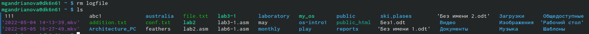
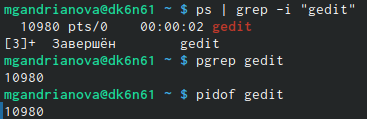
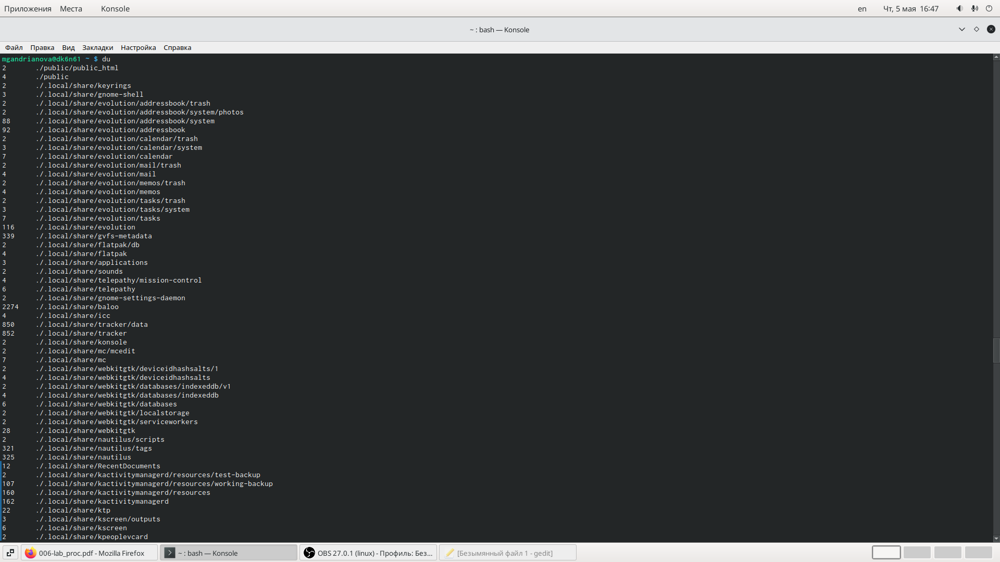

---
## Front matter
title: "Отчёт по лабораторной работе № 6"
subtitle: "*дисциплина:* Операционные системы"
author: "Андрианова Марина Георгиевна"

## Generic otions
lang: ru-RU
toc-title: "Содержание"

## Bibliography
bibliography: bib/cite.bib
csl: pandoc/csl/gost-r-7-0-5-2008-numeric.csl

## Pdf output format
toc: true # Table of contents
toc-depth: 2
lof: true # List of figures
lot: true # List of tables
fontsize: 12pt
linestretch: 1.5
papersize: a4
documentclass: scrreprt
## I18n polyglossia
polyglossia-lang:
  name: russian
  options:
	- spelling=modern
	- babelshorthands=true
polyglossia-otherlangs:
  name: english
## I18n babel
babel-lang: russian
babel-otherlangs: english
## Fonts
mainfont: PT Serif
romanfont: PT Serif
sansfont: PT Sans
monofont: PT Mono
mainfontoptions: Ligatures=TeX
romanfontoptions: Ligatures=TeX
sansfontoptions: Ligatures=TeX,Scale=MatchLowercase
monofontoptions: Scale=MatchLowercase,Scale=0.9
## Biblatex
biblatex: true
biblio-style: "gost-numeric"
biblatexoptions:
  - parentracker=true
  - backend=biber
  - hyperref=auto
  - language=auto
  - autolang=other*
  - citestyle=gost-numeric
## Pandoc-crossref LaTeX customization
figureTitle: "Рис."
tableTitle: "Таблица"
listingTitle: "Листинг"
lofTitle: "Список иллюстраций"
lotTitle: "Список таблиц"
lolTitle: "Листинги"
## Misc options
indent: true
header-includes:
  - \usepackage{indentfirst}
  - \usepackage{float} # keep figures where there are in the text
  - \floatplacement{figure}{H} # keep figures where there are in the text
---

#### Цель работы

Ознакомление с инструментами поиска файлов и фильтрации текстовых данных.
Приобретение практических навыков: по управлению процессами (и заданиями), по
проверке использования диска и обслуживанию файловых систем.

#### Выполнение лабораторной работы

1. Осуществим вход в систему,используя соответствующее имя пользователя.
2. Запишем в файл file.txt названия файлов,содержащихся в каталоге /etc.Для этого введём команду "ls -a /etc > file.txt".Допишем в этот же файл названия файлов,содержащихся в нашем домашнем каталоге с помощью команды "ls -a ~ >> file.txt". Затем просмотрим файл с помощью команды "cat file.txt",чтобы убедиться в правильном выполнении действий(рис.1-2).

{ #fig:001 width=70% }

{ #fig:002 width=70% }

3. Выведем имена всех файлов из file.txt,имеющих расширение .conf,после чего запишем их в новый текстовой файл conf.txt, используя команду "grep -e '\.conf$' file.txt > conf.txt". С помощью команды "cat conf.txt" проверяем правильность выполненных действий(рис.3-4).

{ #fig:003 width=70% }

{ #fig:004 width=70% }

4. Определить,какие файлы в нашем домашнем каталоге имеют имена,начинающиеся с символа c, можно несколькими командами(рис.5). (Опция maxdepth 1 необходима для того, чтобы файлы находились строго только в домашнем каталоге):
``` language
	find ~ -maxdepth 1 -name "c*" -print
	ls ~/c*
	ls -a ~ grep c*
```

{ #fig:005 width=70% }

5. Чтобы вывести на экран (по странично) имена файлов из каталога /etc,начинающиеся с символа h, я использовала команду "find /etc -maxdepth 1 -name "h*" | less" (рис.6-7).

{ #fig:006 width=70% }

{ #fig:007 width=70% }

6. Запустим в фоновом режиме процесс,который будет записывать в файл ~/logfile файлы,имена которых начинаются с log, используя команду "find / -name "log*" > logfile& ".(рис.8).

{ #fig:008 width=70% }

Командой "cat logfile" проверяю выполненные действия(рис.9-10)

{ #fig:009 width=70% }

{ #fig:010 width=70% }

7. Удалим файл ~/logfile с помощью команды(рис.11):
``` language
	rm logfile
```

{ #fig:011 width=70% }

8. Запустим из консоли в фоновом режиме редактор gedit с помощью команды "gedit&"(рис.12). Появится окно редактора(рис.13).

{ #fig:012 width=70% }

{ #fig:013 width=70% }

9. Чтобы определить идентификатор процесса gedit,используем команду " ps | grep -i "gedit" ".Наш процесс имеет PID 10980.(рис.14).Определить идентификатор процесса можно и другими командами(рис.14):
``` language
	pgrep gedit
	pidof gedit
```
{ #fig:014 width=70% }

10. Прочитав справку (man) команды kill с помощью команды "man kill"(рис.15-17), используем её для завершения процесса gedit(команда "kill %10980") (рис.18).

{ #fig:015 width=70% }

{ #fig:016 width=70% }

{ #fig:017 width=70% }

{ #fig:018 width=70% }

11. Выполним команды df(рис.22) и du(рис.23-24),предварительно получив более подробную информацию об этих командах(рис.20-21),с помощью команд "man df"(рис.19) и "man du"(рис.19).

{ #fig:019 width=70% }

{ #fig:020 width=70% }

{ #fig:021 width=70% }

{ #fig:022 width=70% }

{ #fig:023 width=70% }

{ #fig:024 width=70% }

12. Воспользуемся справкой команды find(рис.26), введя команду "man find"(рис.25).Затем выведем имена всех директорий,имеющихся в нашем домашнем каталоге, с помощью команды "find ~ -type d" (рис.27-28).

{ #fig:025 width=70% }

{ #fig:026 width=70% }

{ #fig:027 width=70% }

{ #fig:028 width=70% }


#### Выводы

Я познакомилась с инструментами поиска файлов и фильтрации текстовых данных.Приобрела практические навыки: по управлению процессами (и заданиями), по проверке использования диска и обслуживанию файловых систем.

## Контрольные вопросы
1. В системе по умолчанию открыто три специальных потока:
– stdin —стандартный поток ввода(поумолчанию:клавиатура),файловый дескриптор 0;
– stdout —стандартный поток вывода (по умолчанию: консоль),файловый дескриптор 1;
– stderr —стандартный поток вывод сообщений об ошибках (по умолчанию: консоль),файловый дескриптор 2.
Большинство используемых в консоли команд и программ записывают результаты своей работы в стандартный поток вывода stdout.
2. '>' означает перенаправление вывода (stdout) в файл.
'>>' означает перенаправление вывода в файл и открытие файла в режиме добавления(данные добавляются в конец файла).
3. Конвейер (pipe) служит для объединения простых команд или утилит в цепочки,в которых результат работы предыдущей команды передаётся последующей. Синтаксис
следующий:
``` language
 команда 1 | команда 2
 # означает, что вывод команды 1 передастся на ввод команде 2
```

4. Процесс рассматривается операционной системой как заявка на потребление всех видов ресурсов, кроме одного − процессорного времени. Этот последний важнейший ресурс распределяется операционной системой между другими единицами работы − потоками, которые и получили свое название благодаря тому, что они представляют собой последовательности (потоки выполнения) команд.
Процесс − это выполнение программы. Он считается активной сущностью и реализует действия, указанные в программе.
Программа представляет собой статический набор команд, а процесс это набор ресурсов и данных, использующихся при выполнении программы.
5. pid: идентификатор процесса (PID) процесса (processID), к которому вызывают метод gid: идентификатор группы UNIX, в котором работает программа.
6. Любую выполняющуюся в консоли команду или внешнюю программу можно запустить в фоновом режиме. Для этого следует в конце имени команды указать знак амперсанда &.
Запущенные фоном программы называются задачами (jobs). Ими можно управлять с помощью команды jobs, которая выводит список запущенных в данный момент задач.
7. top − это консольная программа, которая показывает список работающих процессов в системе. Программа в реальном времени отсортирует запущенные процессы по их нагрузке на процессор.
htop − это продвинутый консольный мониторинг процессов. Утилита выводит постоянно меняющийся список системных процессов, который сортируется в зависимости от нагрузки на ЦПУ. Если делать сравнение сtop, то htop показывает абсолютно все процессы в системе, время их непрерывного использования, загрузку процессоров и расход оперативной памяти.
8. find − это команда для поиска файлов и каталогов на основе специальных условий. Ее можно использовать в различных обстоятельствах, например, для поиска файлов по разрешениям, владельцам, группам, типу, размеру и другим подобным критериям.
Команда find имеет такой синтаксис:
``` language
find[папка][параметры] критерий шаблон [действие]
```
Папка − каталог в котором будем искать
Параметры − дополнительные параметры, например, глубина поиска, и т д.
Критерий − по какому критерию будем искать: имя, дата создания, права, владелец и т д.
Шаблон – непосредственно значение по которому будем отбирать файлы.
Основные параметры:
-P никогда не открывать символические ссылки
-L - получает информацию о файлах по символическим ссылкам. Важно для дальнейшей обработки, чтобы обрабатывалась не ссылка, а сам файл.
-maxdepth - максимальная глубина поиска по подкаталогам,для поиска только в текущем каталоге установите 1.
-depth - искать сначала в текущем каталоге, а потом в подкаталогах
-mount искать файлы только в этой файловой системе.
-version - показать версию утилиты find
-print - выводить полные имена файлов
-typef - искать только файлы
-typed - поиск папки в Linux
Основные критерии:
-name - поиск файлов по имени
-perm - поиск файлов в Linux по режиму доступа
-user - поиск файлов по владельцу
-group - поиск по группе
-mtime - поиск по времени модификации файла
-atime - поиск файлов по дате последнего чтения
-nogroup - поиск файлов, не принадлежащих ни одной группе
-nouser - поиск файлов без владельцев
-newer - найти файлы новее чем указанный
-size - поиск файлов в Linux по их размеру
Примеры:
find~ -type d поиск директорий в домашнем каталоге
find~ -type f -name ".*" поиск скрытых файлов в домашнем каталоге
9. Файл по его содержимому можно найти с помощью команды grep: «grep -r" слово/выражение, которое нужно найти"».
10. Утилита df, позволяет проанализировать свободное пространство на всех подключенных к системе разделах.
11. При выполнении команды du (без указания папки и опции) можно получить все файлы и папки текущей директории с их размерами. Для домашнего каталога: du ~/
12. Основные сигналы (каждый сигнал имеет свой номер), которые используются для завершения процесса:
    • SIGINT–самый безобидный сигнал завершения, означает Interrupt. Он отправляется процессу, запущенному из терминала с помощью сочетания клавиш Ctrl+C. Процесс правильно завершает все свои действия и возвращает управление;
    • SIGQUIT–это еще один сигнал, который отправляется с помощью сочетания клавиш, программе, запущенной в терминале. Он сообщает ей что нужно завершиться и программа может выполнить корректное завершение или проигнорировать сигнал. В отличие от предыдущего, она генерирует дамп памяти. Сочетание клавиш Ctrl+/;
    • SIGHUP–сообщает процессу, что соединение с управляющим терминалом разорвано, отправляется, в основном, системой при разрыве соединения с интернетом;
    • SIGTERM–немедленно завершает процесс, но обрабатывается программой, поэтому позволяет ей завершить дочерние процессы и освободить все ресурсы;
    • SIGKILL–тоже немедленно завершает процесс, но, в отличие от предыдущего варианта, он не передается самому процессу, а обрабатывается ядром. Поэтому ресурсы и дочерние процессы остаются запущенными.
Также для передачи сигналов процессам в Linux используется утилита kill, её синтаксис: kill [-сигнал] [pid_процесса] (PID – уникальный идентификатор процесса). Сигнал представляет собой один из выше перечисленных сигналов для завершения процесса.
Перед тем, как выполнить остановку процесса, нужно определить его PID. Для этого используют команды ps и grep. Команда ps предназначена для вывода списка активных процессов в системе и информации о них. Команда grep запускается одновременно с ps (вканале) и будет выполнять поиск по результатам команды ps.
Утилита pkill – это оболочка для kill, она ведет себя точно так же, и имеет тот же синтаксис, только в качестве идентификатора процесса ей нужно передать ег оимя.
killall работает аналогично двум предыдущим утилитам. Она тоже принимает имя процесса в качестве параметра и ищет его PID в директории /proc. Но эта утилита обнаружит все процессы с таким именем и завершит их.
