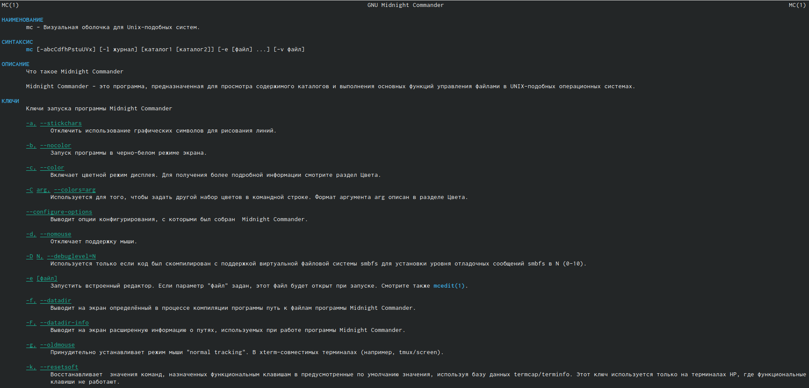
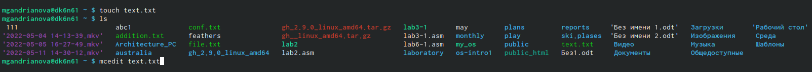
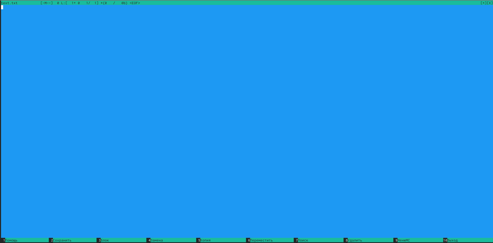
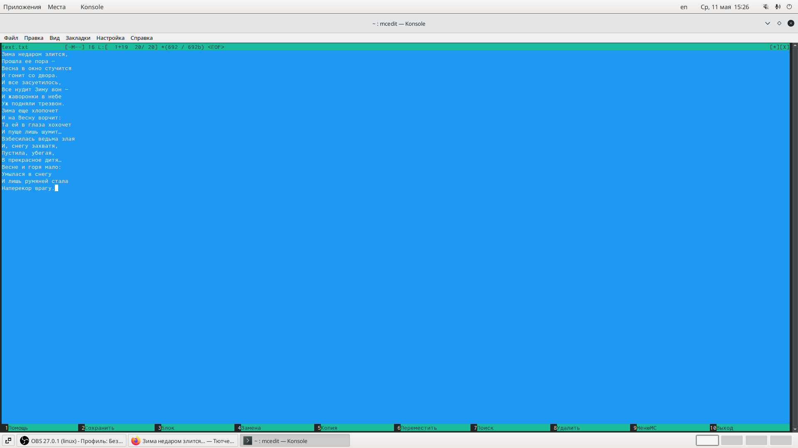
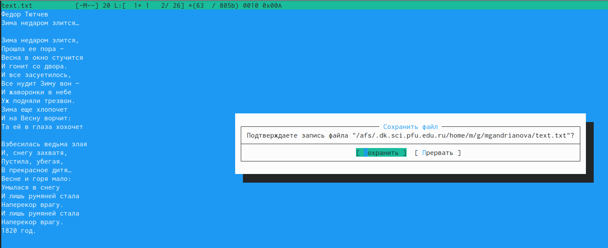
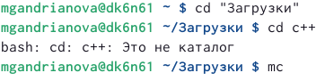
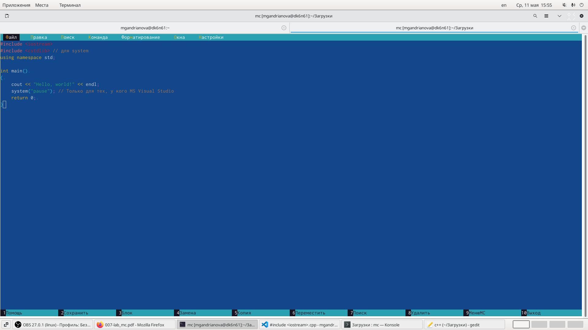
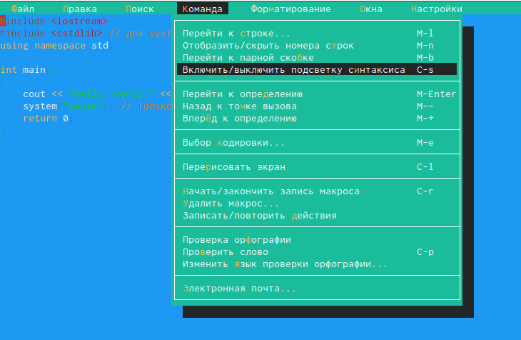
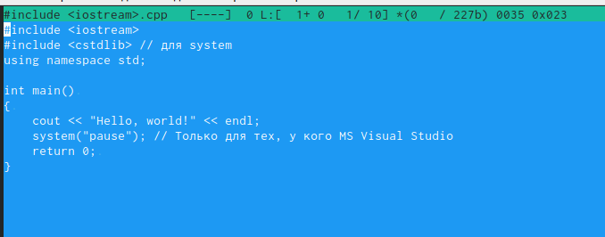

---
## Front matter
lang: ru-RU
title: Лабораторная работа № 7
author: |
	Андрианова Марина Георгиевна
institute: |
	\inst{1}RUDN University, Moscow, Russian Federation
date: NEC--2022, 13 May

## Formatting
toc: false
slide_level: 2
theme: metropolis

aspectratio: 43
section-titles: true
---

## Цель работы
Освоение основных возможностей командной оболочки Midnight Commander.Приобретение навыков практической работы по просмотру каталогов и файлов; манипуляций с ними.

## Команда mc
Изучила информацию о mc,вызвав в командной строке "man mc" (рис.1). Midnight Commander(или mc)- псевдографическая командная оболочка для UNIX/Linux систем.

{ #fig:001 width=70% }

## Создание текстового файла
С помощью команды "touch text.txt" создаём текстовой файл text.txt.Командой "ls" проверяем правильность выполненных действий.Открываем этот файл с помощью встроенного mc редактора командой "mcedit text.txt"(рис.2, рис.3).

{ #fig:069 width=70% }

{ #fig:070 width=70% }

## Работа с текстовым файлом
Вставила в открытый файл небольшой фрагмент текста,скопированный из Интернета(рис.4).

{ #fig:071 width=70% }

## Манипуляции с текстовым файлом
После различных манипуляций сохраняем текстовый файл(рис.5).

{ #fig:083 width=70% }

## Файл на языке программирования C++
Открыла файл с исходным текстом на языке программирования  C++ в редакторе mc(рис.7) с помощью команды "mc"(перед этим выстроила путь к файлу на консоли-рис.6).

{ #fig:084 width=70% }

{ #fig:085 width=70% }

## Выключение подсветки
Используя меню редактора "Команда"->"Включить/выключить подсветку синтаксиса"(рис.8),выключила подсветку синтаксиса(рис.9).

{ #fig:086 width=70% }

{ #fig:087 width=70% }

## Выводы
Я освоила основные возможности командной оболочки Midnight Commander, приобрела навыки практической работы по просмотру каталогов и файлов; манипуляций с ними.

