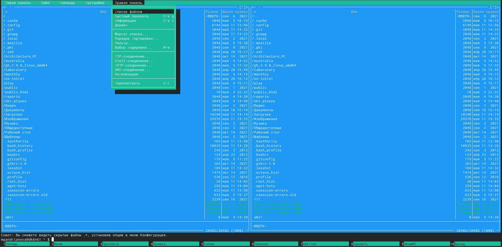
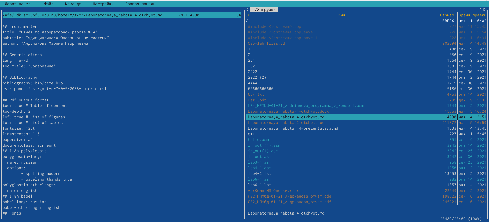
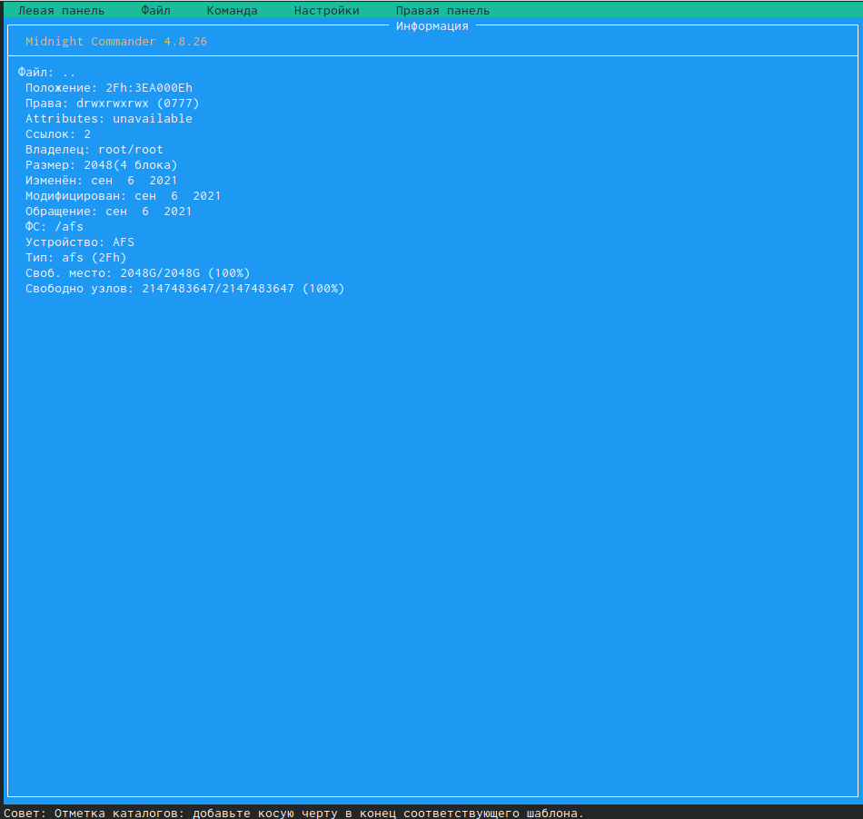
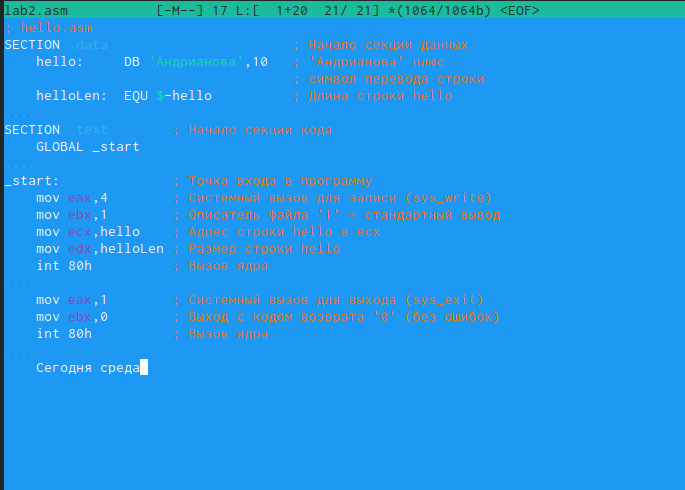
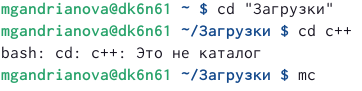

---
## Front matter
title: "Отчёт по лабораторной работе № 7"
subtitle: "*дисциплина:* Операционные системы"
author: "Андрианова Марина Георгиевна"

## Generic otions
lang: ru-RU
toc-title: "Содержание"

## Bibliography
bibliography: bib/cite.bib
csl: pandoc/csl/gost-r-7-0-5-2008-numeric.csl

## Pdf output format
toc: true # Table of contents
toc-depth: 2
lof: true # List of figures
lot: true # List of tables
fontsize: 12pt
linestretch: 1.5
papersize: a4
documentclass: scrreprt
## I18n polyglossia
polyglossia-lang:
  name: russian
  options:
	- spelling=modern
	- babelshorthands=true
polyglossia-otherlangs:
  name: english
## I18n babel
babel-lang: russian
babel-otherlangs: english
## Fonts
mainfont: PT Serif
romanfont: PT Serif
sansfont: PT Sans
monofont: PT Mono
mainfontoptions: Ligatures=TeX
romanfontoptions: Ligatures=TeX
sansfontoptions: Ligatures=TeX,Scale=MatchLowercase
monofontoptions: Scale=MatchLowercase,Scale=0.9
## Biblatex
biblatex: true
biblio-style: "gost-numeric"
biblatexoptions:
  - parentracker=true
  - backend=biber
  - hyperref=auto
  - language=auto
  - autolang=other*
  - citestyle=gost-numeric
## Pandoc-crossref LaTeX customization
figureTitle: "Рис."
tableTitle: "Таблица"
listingTitle: "Листинг"
lofTitle: "Список иллюстраций"
lotTitle: "Список таблиц"
lolTitle: "Листинги"
## Misc options
indent: true
header-includes:
  - \usepackage{indentfirst}
  - \usepackage{float} # keep figures where there are in the text
  - \floatplacement{figure}{H} # keep figures where there are in the text
---

# Цель работы

Освоение основных возможностей командной оболочки Midnight Commander.Приобретение навыков практической работы по просмотру каталогов и файлов; манипуляций с ними.

# Задание

1. Сделать отчёт по лабораторной работе № 7 в формате Markdown.
2. Освоить основные возможности командной оболочки Midnight Commander.

# Выполнение лабораторной работы

1).Изучила информацию о mc,вызвав в командной строке "man mc" (рис.1,рис.2). Midnight Commander(или mc)- псевдографическая командная оболочка для UNIX/Linux систем.Для запуска mc необходимо в командной строке набрать "mc" и нажать "enter".

{ #fig:001 width=70% }

{ #fig:002 width=70% }

2). Запустила из командной строки mc и изучила его структуру и меню(рис.3,рис.4,рис.5, рис.6,рис.7,рис.8,рис.9,рис.10,рис.11). В стандартном состоянии окно редактора состоит из двух панелей(рис.4). Верхнее меню содержит меню "Левая панель","Файл","Команда","Настройки","Правая панель"(рис.5, рис.6,рис.7,рис.8,рис.9). Нажав клавишу "F2", можно открыть "Меню пользователя"(рис.10). Нажав клавишу "F1", можно открыть "Помощь"(рис.11). 

{ #fig:003 width=70% }

{ #fig:004 width=70% }

{ #fig:005 width=70% }

{ #fig:006 width=70% }

{ #fig:007 width=70% }

{ #fig:008 width=70% }

{ #fig:009 width=70% }

{ #fig:010 width=70% }

{ #fig:011 width=70% }

3).Выполнила несколько операций в mc,используя управляющие клавиши 
1. Выделение/отмена выделения файлов. Использую клавишу "ins" и выделяю файл "australia"(он выделяется желтым цветом) (рис.12).

{ #fig:012 width=70% }

2. Копирование/перемещение файлов. Для копирования файлов используется клавиша "F5"(рис.13).

{ #fig:013 width=70% }

Для перемещения файла использовала клавишу "F6"(рис.14).Я переместила каталог "plans" из "ski.plases" в домашний каталог(рис.15).

{ #fig:014 width=70% }

{ #fig:015 width=70% }

3. Получение информации о размере и правах доступа на файлы и/или каталоги. Для получения данной информации можно перейти в команды: "Левая панель"->"Информация"(рис.16,рис.17).

{ #fig:016 width=70% }

{ #fig:017 width=70% }

"Левая панель"->"Формат списка"->"Расширенный"(рис.18, рис.19, рис.20).

{ #fig:018 width=70% }

{ #fig:019 width=70% }

{ #fig:020 width=70% }

"Файл"->"Права доступа"(рис.21, рис.22).

{ #fig:021 width=70% }

{ #fig:022 width=70% }

"Файл"->"Права(расширенные)"(рис.23, рис.24).

{ #fig:023 width=70% }

{ #fig:024 width=70% }

4).Выполнила основные команды меню левой панели(рис.25).

{ #fig:025 width=70% }

4.1. Пункт "Список файлов" отображает размер файла и время его правки(рис.26).

{ #fig:026 width=70% }

4.2. Пункт "Быстрый просмотр" нужен для предпросмотра содержания файла(рис.27).

{ #fig:027 width=70% }

4.3. Пункт "Информация" отображает подробные данные о файле (рис.28, рис.29).

{ #fig:028 width=70% }

{ #fig:029 width=70% }

4.4 Пункт "Дерево" необходим для просмотра дерева каталога (отображает минимум информации)(рис.30).

{ #fig:030 width=70% }

4.5. Пункт "Формат списка"->"Укороченный" отображает только имя файла или каталога(видна минимальная информация)(рис.31, рис.32).

{ #fig:031 width=70% }

{ #fig:032 width=70% }

4.6. Пункт "Формат списка"->"Расширенный" отображает подробную информацию о файлах, но менее подробную, чем пункт "Информация"(рис.33).

{ #fig:033 width=70% }

4.7. Пункт "Формат списка"->"Определённый пользователем" предоставляет пользователю возможность самому изменять степень подробности информации о файле, но она будет менее подробной, чем в пункте "Информация".
4.8. Пункт "Формат списка"->"Стандартный" ставится по умолчанию (рис.34).

{ #fig:034 width=70% }

4.9. Пункт "Порядок сортировки" необходим для сортировки файлов или каталогов по конкретному критерию(рис.35).

{ #fig:035 width=70% }

4.10. Пункт "Фильтр" необходим, чтобы просматривать названия файлов или каталогов, которые подходят под указанную маску(рис.36).

{ #fig:036 width=70% }

4.11. Пункт "Выбор кодировки" нужен для просмотра и смены кодировки(рис.37).

{ #fig:037 width=70% }

5). Используя возможности подменю "Файл"(рис.38) выполним:
 
{ #fig:038 width=70% }

5.1. Просмотр содержимого текстового файла. Выберем текстовый файл и перейдём в пункт "Просмотр"(рис.39)

{ #fig:039 width=70% }

5.2. Редактирование содержимого текстового файла(рис.40). Результат не сохраняем(рис.41).

{ #fig:040 width=70% }

{ #fig:041 width=70% }

5.3. Создание каталога. Перешла в пункт "Создание каталога"(рис.42) и создала каталог "Среда".

{ #fig:042 width=70% }

5.4. Копирование файлов в созданный каталог. Для этого, используя клавишу "Ins", выделила несколько файлов(рис.43).

{ #fig:043 width=70% }

После этого, выбрав пункт "Копирование", скопируем данные файлы в созданный каталог "Среда"(рис.44, рис.45).

{ #fig:044 width=70% }

{ #fig:045 width=70% }

6). Используя соответствующие средства подменю "Команда"(рис.46) осуществим: 

{ #fig:046 width=70% }

6.1. Поиск в файловой системе файла с заданными условиями. Перешла в пункт "Поиск файла" и задала следующие параметры: "От каталога": /afs/.dk.sci.pfu.edu.ru/home/m/g/mgandrianova,"Шаблон имени": .asm,"Содержимое": .(рис.47) и осуществила поиск нужных файлов(рис.48).

{ #fig:047 width=70% }

{ #fig:048 width=70% }

6.2. Выбор и повторение одной из предыдущих команд. Перешла в пункт "История командной строки" и увидела, что внизу экрана появилась сноска "История", в ней команда "cd /tmp"(рис.49). Повторяем её(рис.50). Перемещаемся в каталог /tmp(рис.51).

{ #fig:049 width=70% }

{ #fig:050 width=70% }

{ #fig:051 width=70% }

6.3. Переход в домашний каталог. Для перехода в домашний каталог перешла в пункт "Дерево каталогов"(рис.52), выбрала необходимый каталог и нажала "enter", в результате чего в левой панели перешла в домашний каталог(рис.53).

{ #fig:052 width=70% }

{ #fig:053 width=70% }

6.4. Анализ файла меню и файла расширений. Перешла в пункт "Редактировать файл расширений"(рис.54). "Редактировать файл расширений" позволяет задать с помощью определённого синтаксиса действия при запуске файлов с определённым расширением(рис.55). Пункт "Редактировать файл меню"(рис.56) позволяет отредактировать контекстное меню пользователя(рис.57, рис.58).

{ #fig:054 width=70% }

{ #fig:055 width=70% }

{ #fig:056 width=70% }

{ #fig:057 width=70% }

{ #fig:058 width=70% }

7). Вызвала подменю "Настройки"(рис.59). Освоила операции, определяющие структуру экрана mc:

{ #fig:059 width=70% }

7.1. Перешла в пункт "Конфигурация"(рис.60).Этот пункт позволяет скорректировать настройки работы с панелями.

{ #fig:060 width=70% }

7.2. Перешла в пункт "Внешний вид"(рис.61), а затем в пункт "Настройки панелей"(рис.62). Данные пункты определяют элементы, отображаемые при вызове mc, а также геометрию расположения панелей и цветовыделение.

{ #fig:061 width=70% }

{ #fig:062 width=70% }

7.3. Перешла в пункт "Подтверждение"(рис.63). Этот пункт позволяет установить или убрать вывод окна с запросом подтверждения действий при операциях удаления и презаписи файлов, а также при выходе из программы.

{ #fig:063 width=70% }

7.4. Перешла в пункт "Оформление"(рис.64).Данный пункт позволяет поменять цветовую гамму визуальной оболочки для комфортной работы.

{ #fig:064 width=70% }

7.5. Перешла в пункт "Биты символов"(рис.65). Этот пункт задаёт формат обработки локальным терминалом.

{ #fig:065 width=70% }

7.6. Перешла в пункт "Распознавание клавиш"(рис.66). Данное диалоговое окно используется для тестирования функциональных клавиш, клавишу правления курсором и прочее.

{ #fig:066 width=70% }

7.7. Перешла в пункт "Виртуальная файловая система"(рис.67).Это настройки виртуальной файловой системы: тайм-аут,пароль и прочее.

{ #fig:067 width=70% }

7.8. Перешла в пункт "Сохранить настройки"(рис.68).Данный пункт сохранит все изменения.

{ #fig:068 width=70% }

Задание 2(работа с редактором mc)
1).С помощью команды "touch text.txt" создаём текстовой файл text.txt.Командой "ls" проверяем правильность выполненных действий.Открываем этот файл с помощью встроенного mc редактора командой "mcedit text.txt"(рис.69, рис.70)

{ #fig:069 width=70% }

{ #fig:070 width=70% }

2). См. пункт 1 второго задания.
3).Вставила в открытый файл небольшой фрагмент текста,скопированный из Интернета(рис.71).

{ #fig:071 width=70% }

4). Проделаем с текстом следующие манипуляции,используя горячие клавиши:
4.1. Удалим строку текста "И пуще лишь шумит..."(рис.72) с помощью клавиши "F8".(рис.73).

{ #fig:072 width=70% }

{ #fig:073 width=70% }

4.2. Выделила фрагмент текста,нажав "F3" для начала выделения текста и для его окончания(рис.74), и скопировала его на новую строку, используя клавишу "F5"(рис.75).

{ #fig:074 width=70% }

{ #fig:075 width=70% }

4.3. Выделила фрагмент текста и перенесла его на новую строку(рис.76).

{ #fig:076 width=70% }

4.4. Сохранила файл,нажав "F2"(рис.77).

{ #fig:077 width=70% }

4.5. Отменила последнее действие с помощью сочетания клавиш "Ctrl"+"u"(рис.78).

{ #fig:078 width=70% }

4.6.Перешла в конец файла (нажав комбинацию клавиш "Ctrl"+"End")(рис.79) и написала следующий текст:"1820 год"(рис.80).

{ #fig:079 width=70% }

{ #fig:080 width=70% }

4.7.Перешла в начало файла (нажав комбинацию клавиш "Ctrl"+"Home")(рис.81) и написала следующий текст: "Федор Тютчев Зима недаром злится..."(рис.82).

{ #fig:081 width=70% }

{ #fig:082 width=70% }

4.8. Выполнила сохранение файла(клавиша "F2")(рис.83) и закрыла файл(клавиша "F10").

{ #fig:083 width=70% }

5).Открыла файл с исходным текстом на языке программирования  C++ в редакторе mc(рис.85) с помощью команды "mc"(перед этим выстроила путь к файлу на консоли-рис.84).

{ #fig:084 width=70% }

{ #fig:085 width=70% }

6).Используя меню редактора "Команда"->"Включить/выключить подсветку синтаксиса"(рис.86),выключила подсветку синтаксиса(рис.87).

{ #fig:086 width=70% }

{ #fig:087 width=70% }

# Выводы

Я освоила основные возможности командной оболочки Midnight Commander, приобрела навыки практической работы по просмотру каталогов и файлов; манипуляций с ними.

# Контрольные вопросы

1) Панели могут дополнительно быть переведены в один из двух режимов: «Информация» или «Дерево». В режиме «Информация» на панель выводятся сведения о файле и текущей файловой системе, расположенных на активной панели. В режиме «Дерево» на одной из панелей выводится структура дерева каталогов.

2) Как с помощью команд shell, так и с помощью меню (комбинаций клавиш) mc можно выполнить следующие операции с файлами:

    копирование «F5» («cp имя_файла имя_каталога (в который копируем)») (Рисунок 13)

    перемещение/переименование «F6» («mv имя_файла имя_каталога (в который перемещаем)»)(Рисунок 14)

    создание каталога «F7» («mkdir имя_каталога»)(Рисунок 42)

    удаление «F8» («rm имя_файла»)

    изменение прав доступа «ctrl+x» («chmod u+x имя_файла»)

3) Перейти в строку меню панелей mc можно с помощью функциональной клавиши «F9». В строке меню имеются пять меню: «Левая панель», «Файл», «Команда», «Настройки» и «Правая панель».

Подпункт меню «Быстрый просмотр» позволяет выполнить быстрый просмотр содержимого панели.

Подпункт меню «Информация» позволяет посмотреть информацию о файле или каталоге. В меню каждой (левой или правой) панели можно выбрать «Формат списка»:

    стандартный − выводит список файлов и каталогов с указанием размера и времени правки;

    ускоренный − позволяет задать число столбцов, на которые разбивается панель при выводе списка имён файлов или каталогов без дополнительной информации;

    расширенный − помимо названия файла или каталога выводит сведения о правах доступа, владельце, группе, размере, времени правки;

    определённый пользователем − позволяет вывести те сведения о файле или каталоге, которые задаст сам пользователь.

Подпункт меню «Порядок сортировки» позволяет задать критерии сортировки при выводе списка файлов и каталогов: без сортировки, по имени, расширенный, время правки, время доступа, время изменения атрибута, размер, узел.

4) Команды меню «Файл»:

    Просмотр(«F3»)− позволяет посмотреть содержимое текущего (или выделенного) файла без возможности редактирования.

    Просмотр вывода команды («М»+«!»)− функция запроса команды с параметрами (аргумент к текущему выбранному файлу).

    Правка(«F4») − открывает текущий (или выделенный) файл для его редактирования.

    Копирование(«F5»)− осуществляет копирование одного или нескольких файлов или каталогов в указанное пользователем во всплывающем окне место.

    Права доступа («Ctrl-x»«c»)− позволяет указать (изменить) права доступа к одному или нескольким файлам или каталогам.

    Жёсткая ссылка («Ctrl-x»«l»)− позволяет создать жёсткую ссылку к текущему(или выделенному) файлу.

    Символическая ссылка («Ctrl-x»«s»)− позволяет создать символическую ссылку к текущему (или выделенному) файлу.

    Владелец/группа («Ctrl-x»«o»)− позволяет задать (изменить) владельца и имя группы для одного или нескольких файлов или каталогов.

    Права(расширенные)− позволяет изменить права доступа и владения для одного или нескольких файлов или каталогов.

    Переименование («F6»)− позволяет переименовать (или переместить) один или несколько файлов или каталогов.

    Создание каталога («F7») − позволяет создать каталог.

    Удалить («F8») − позволяет удалить один или несколько файлов или каталогов.

    Выход («F10») − завершает работу mc.

5) Меню Команда

В меню Команда содержатся более общие команды для работы с mc.

Команды меню Команда:

    Дерево каталогов − отображает структуру каталогов системы.

    Поиск файла − выполняет поиск файлов по заданным параметрам.

    Переставить панели − меняет местами левую и правую панели.

    Сравнить каталоги («Ctrl-x»«d») − сравнивает содержимое двух каталогов.

    Размеры каталогов − отображает размер и время изменения каталога (по умолчанию в mc размер каталога корректно не отображается).

    История командной строки − выводит на экран список ранее выполненных в оболочке команд.

    Каталоги быстрого доступа(Ctrl-\»)− при вызове выполняется быстрая смена текущего каталога на один из заданного списка.

    Восстановление файлов − позволяет восстановить файлы на файловых системах ext2 и ext3.

    Редактировать файл расширений − позволяет задать с помощью определённого синтаксиса действия при запуске файлов с определённым расширением (например, какое программное обеспечение запускать для открытия или редактирования файлов с расширением doc или docx).

    Редактировать файл меню − позволяет отредактировать контекстное меню пользователя, вызываемое по клавише «F2».

    Редактировать файл расцветки имён − позволяет подобрать оптимальную для пользователя расцветку имён файлов в зависимости от их типа.

6) Меню Настройки содержит ряд дополнительных опций по внешнему виду и функциональности mc.

Меню Настройки содержит:

    Конфигурация − позволяет скорректировать настройки работы с панелями.

    Внешний вид и Настройки панелей − определяет элементы (строка меню, командная строка, подсказки и прочее), отображаемые при вызове mc, а также геометрию расположения панелей и цветовыделение.

    Биты символов − задаёт формат обработки информации локальным терминалом.

    Подтверждение − позволяет установить или убрать вывод окна с запросом подтверждения действий при операциях удаления и перезаписи файлов, а также при выходе из программы.

    Распознание клавиш − диалоговое окно используется для тестирования функциональных клавиш, клавиш управления курсором и прочее.

    Виртуальные ФС − настройки виртуальной файловой системы: тайм-аут, пароль и прочее.

7) Функциональные клавиши mc:

    F1 – вызов контекстно-зависимой подсказки

    F2 – вызов пользовательского меню с возможностью создания и/или дополнения дополнительных функций

    F3 – просмотр содержимого файла, на который указывает подсветка в активной панели (без возможности редактирования)

    F4 – вызов встроенного в mc редактора для изменения содержания файла, на который указывает подсветка в активной панели

    F5 – копирование одного или нескольких файлов, отмеченных впервой (активной) панели, в каталог, отображаемый на второй панели

    F6 – перенос одного или нескольких файлов, отмеченных в первой (активной) панели, в каталог, отображаемый на второй панели

    F7 – создание подкаталога в каталоге, отображаемом в активной панели

    F8 – удаление одного или нескольких файлов (каталогов), отмеченных в первой (активной) панели файлов

    F9 – вызов меню mc

    F10 – выход из mc

8) Встроенный в mc редактор вызывается с помощью функциональной клавиши «F4». В нём удобно использовать различные комбинации клавиш при редактировании содержимого (как правило текстового) файла. Клавиши для редактирования файла:

    «Ctrl-y» − удалить строку

    «Ctrl-u» − отмена последней операции

    «ins» - вставка/замена

    «F7» − поиск (можно использовать регулярные выражения)

    «↑-F7» − повтор последней операции поиска

    «F4» − замена

    «F3» − первое нажатие − начало выделения, второе − окончание выделения

    «F5» − копировать выделенный фрагмент

    «F6» − переместить выделенный фрагмент

    «F8» − удалить выделенный фрагмент

    «F2» − записать изменения в файл

    «F10» − выйти из редактор

9) Для редактирования меню пользователя, которое вызывается клавишей «F2», необходимо перейти в пункт «Редактировать файл меню» → «Команда» и изменить настройки файла.

10) Часть команд «Меню пользователя», а также меню «Файл» позволяют выполнять действия, определяемые пользователем, над текущим файлом. Например, копирование каталога или файла, переименование, перемещение, архивирование.

