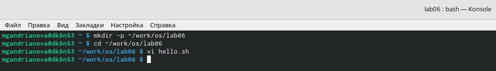
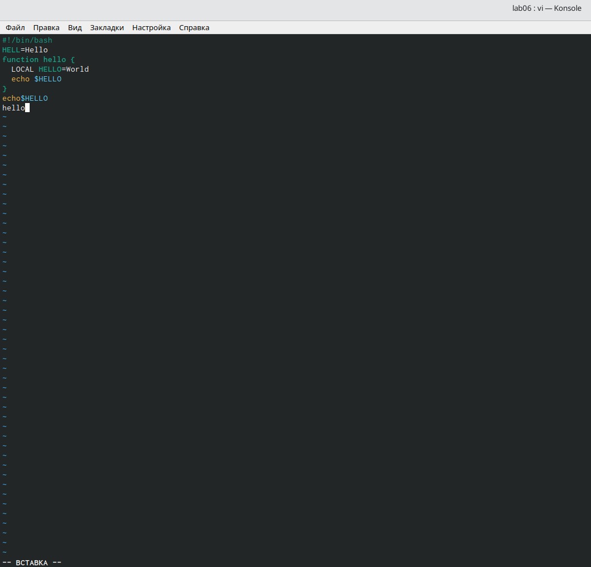
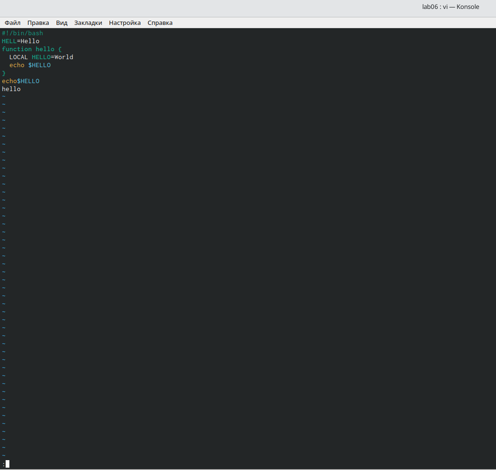
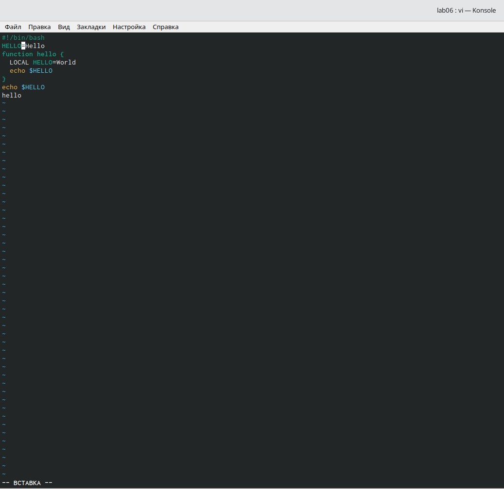
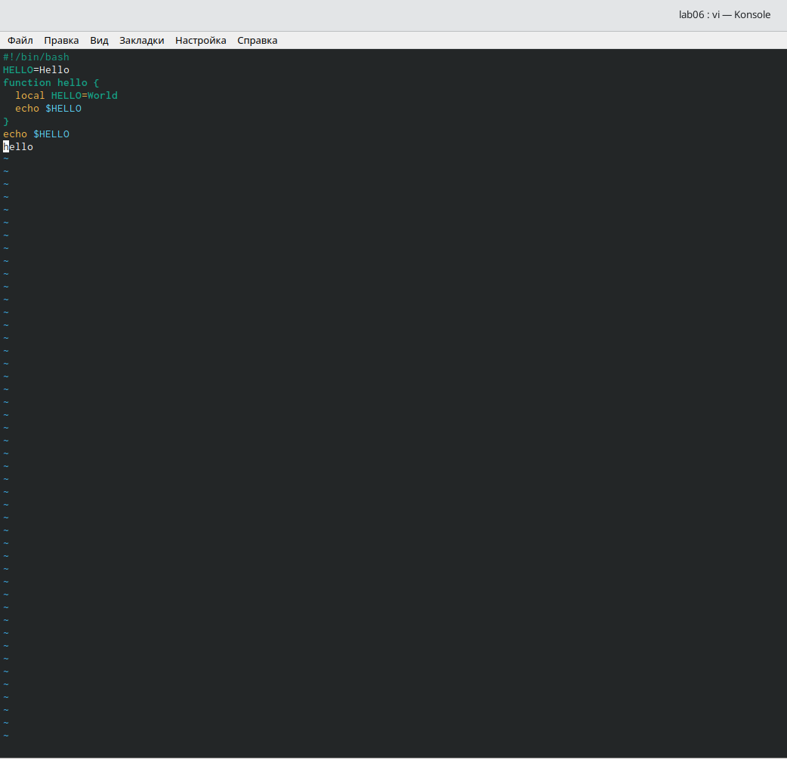

---
## Front matter
lang: ru-RU
title: Лабораторная работа № 8.
author: |
	Андрианова Марина Георгиевна
institute: |
	RUDN University, Moscow, Russian Federation
date: NEC--2022, 14 May 

## Formatting
toc: false
slide_level: 2
theme: metropolis
header-includes: 
 - \metroset{progressbar=frametitle,sectionpage=progressbar,numbering=fraction}
 - '\makeatletter'
 - '\beamer@ignorenonframefalse'
 - '\makeatother'
aspectratio: 43
section-titles: true
---

# Цель работы

Познакомиться с операционной системой Linux. Получить практические навыки работы с редактором vi, установленным по умолчанию практически во всех дистрибутивах.

# Выполнение лабораторной работы

## Создание каталога
Создала каталог с именем ~/work/os/lab06 с помощью команды mkdir(опция -p позволяет создать все каталоги, которые указаны внутри пути)(рис.1)

{ #fig:001 width=70% }

## Работа с текстом в редакторе
Нажимаем клавишу "i" и вводим текст, указанный в лабораторной работе(рис.2).

{ #fig:002 width=70% }

## Работа с текстом в редакторе

Нажимаем ":" для перехода в режим последней строки и внизу нашего экрана видим, что появилось приглашение в виде двоеточия(рис.3).

{ #fig:003 width=70% }

## Работа с текстом в редакторе

Перешла в режим вставки,нажав на клавишу "i", и заменила HELL на HELLO, дописав О. Нажала "Esc" для возврата в командный режим(рис.4).

{ #fig:004 width=70% }

## Работа с текстом в редакторе

Удалила последнюю строку, используя комбинацию клавиш "d" и "d"(рис.5).

{ #fig:005 width=70% }

# Выводы

Я познакомилась с операционной системой Linux. Получила практические навыки работы с редактором vi, установленным по умолчанию практически во всех дистрибутивах.
