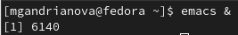
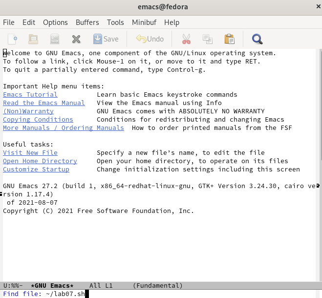
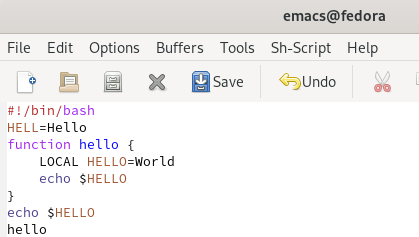
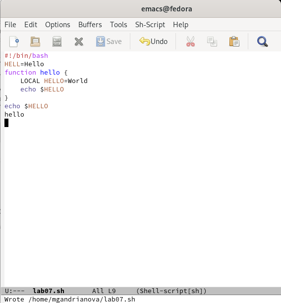

---
## Front matter
lang: ru-RU
title: Лабораторная работа № 9
author: |
	Андрианова Марина Георгиевна\inst{1,3}
institute: |
	\inst{1}RUDN University, Moscow, Russian Federation

date: NEC--2022, 19 May 

## Formatting
toc: false
slide_level: 2
theme: metropolis
header-includes: 
 - \metroset{progressbar=frametitle,sectionpage=progressbar,numbering=fraction}
 - '\makeatletter'
 - '\beamer@ignorenonframefalse'
 - '\makeatother'
aspectratio: 43
section-titles: true
---

## Цель работы
Познакомиться с операционной системой Linux. Получить практические навыки работы с редактором Emacs.

## Редактор Emacs
1).Открыла редактор Emacs в фоновом режиме с помощью команды "emacs &"(рис.1).

{ #fig:001 width=70% }

2).Создала файл lab07.sh с помощью комбинации "Ctrl-x" "Ctrl-f"(рис.2).

{ #fig:002 width=70% }

3).В открывшемся буфере набрала необходимый текст(рис.3).

{ #fig:003 width=70% }

4).Сохранила файл с помощью комбинации "Ctrl-x" "Ctrl-s"(рис.4).

{ #fig:004 width=70% }

## Выполнение
-Проделала с текстом стандартные процедуры редактирования, каждое действие осуществляется комбинацией клавиш.
-Использовала команды по перемещению курсора.
-Управляла буферами,окнами 
-Изучила режим поиска

## Выводы
Я познакомилась с операционной системой Linux и получила практические навыки работы с редактором Emacs.
