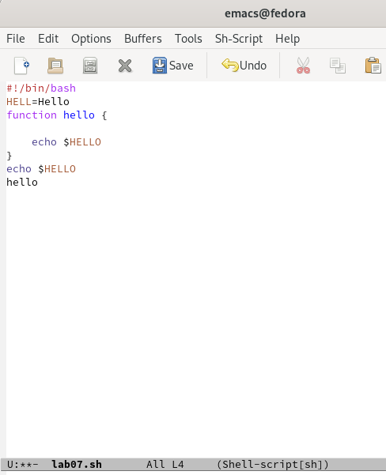
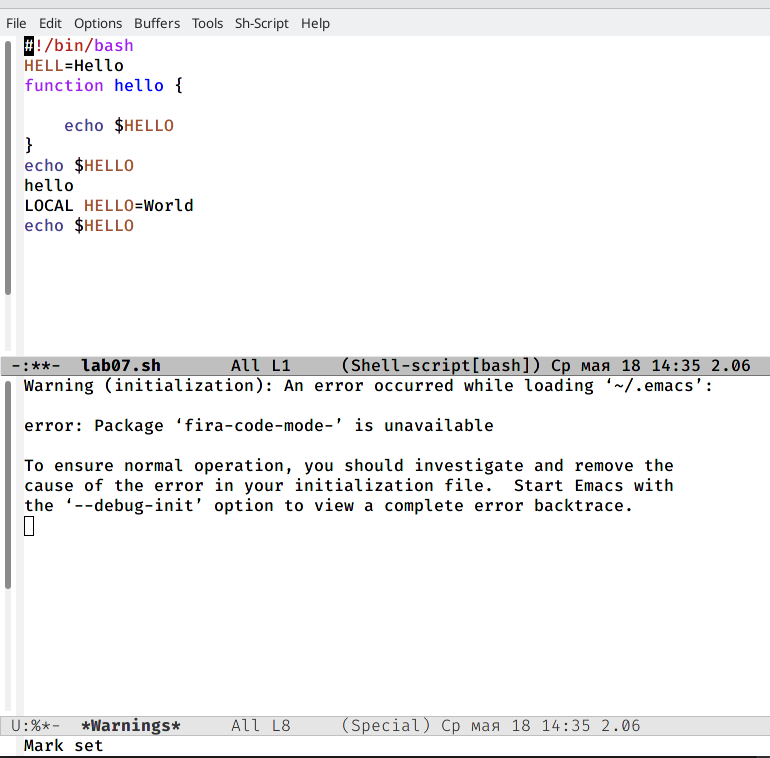
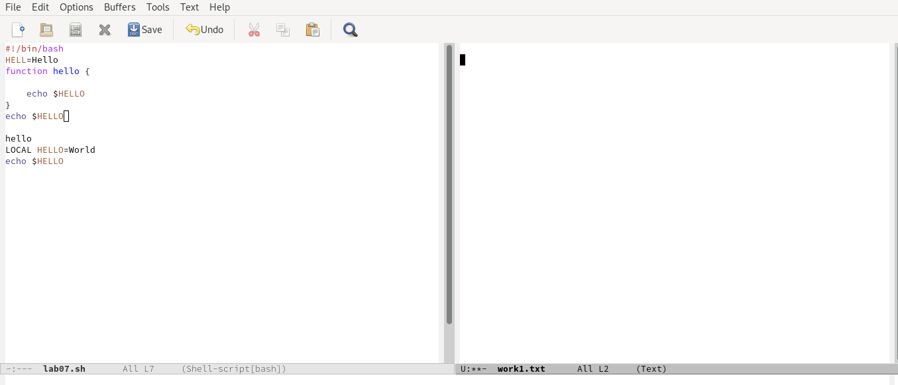

---
## Front matter
title: "Отчёт по лабораторной работе № 9"
subtitle: "*дисциплина:* Операционные системы"
author: "Андрианова Марина Георгиевна"

## Generic otions
lang: ru-RU
toc-title: "Содержание"

## Bibliography
bibliography: bib/cite.bib
csl: pandoc/csl/gost-r-7-0-5-2008-numeric.csl

## Pdf output format
toc: true # Table of contents
toc-depth: 2
lof: true # List of figures
lot: true # List of tables
fontsize: 12pt
linestretch: 1.5
papersize: a4
documentclass: scrreprt
## I18n polyglossia
polyglossia-lang:
  name: russian
  options:
	- spelling=modern
	- babelshorthands=true
polyglossia-otherlangs:
  name: english
## I18n babel
babel-lang: russian
babel-otherlangs: english
## Fonts
mainfont: PT Serif
romanfont: PT Serif
sansfont: PT Sans
monofont: PT Mono
mainfontoptions: Ligatures=TeX
romanfontoptions: Ligatures=TeX
sansfontoptions: Ligatures=TeX,Scale=MatchLowercase
monofontoptions: Scale=MatchLowercase,Scale=0.9
## Biblatex
biblatex: true
biblio-style: "gost-numeric"
biblatexoptions:
  - parentracker=true
  - backend=biber
  - hyperref=auto
  - language=auto
  - autolang=other*
  - citestyle=gost-numeric
## Pandoc-crossref LaTeX customization
figureTitle: "Рис."
tableTitle: "Таблица"
listingTitle: "Листинг"
lofTitle: "Список иллюстраций"
lotTitle: "Список таблиц"
lolTitle: "Листинги"
## Misc options
indent: true
header-includes:
  - \usepackage{indentfirst}
  - \usepackage{float} # keep figures where there are in the text
  - \floatplacement{figure}{H} # keep figures where there are in the text
---

# Цель работы

Познакомиться с операционной системой Linux. Получить практические навыки работы с редактором Emacs.

# Задание

1. Сделать отчёт по лабораторной работе № 9 в формате Markdown.
2. Освоить основные возможности редактора Emacs.

# Выполнение лабораторной работы

1).Открыла редактор Emacs в фоновом режиме с помощью команды "emacs &"(рис.1).

{ #fig:001 width=70% }

2).Создала файл lab07.sh с помощью комбинации "Ctrl-x" "Ctrl-f"(рис.2).

{ #fig:002 width=70% }

3).В открывшемся буфере набрала необходимый текст(рис.3).

{ #fig:003 width=70% }

4).Сохранила файл с помощью комбинации "Ctrl-x" "Ctrl-s"(рис.4).

{ #fig:004 width=70% }

5). Выполнила следующие действия:
5.1. Вырезала одной командой целую строку "Ctrl-k"(рис.5,рис.6).

{ #fig:005 width=70% }

{ #fig:006 width=70% }

5.2. Вставила эту строку в конец файла ("Ctrl-y")(рис.7).

{ #fig:007 width=70% }

5.3. Выделила область текста ("Ctrl-space")(рис.8).

{ #fig:008 width=70% }

5.4. Скопировала область в буфер обмена ("Alt-w") и вставила область в конец файла("Ctrl-y")(рис.9).

{ #fig:009 width=70% }

5.5. Смотри 5.4. пункт.
5.6. Вновь выделила эту область("Ctrl-space")(рис.10) и на этот раз вырезала её ("Ctrl-w")(рис.11).

{ #fig:010 width=70% }

{ #fig:011 width=70% }

5.7. Отменила последнее действие ("Ctrl-/")(рис.12).

{ #fig:012 width=70% }

6). Научилась использовать команды по перемещению курсора:
6.1. Переместила курсор в начало строки ("Ctrl-a")(рис.13, рис.14).

{ #fig:013 width=70% }

{ #fig:014 width=70% }

6.2. Переместила курсор в конец строки ("Ctrl-e")(рис.15).

{ #fig:015 width=70% }

6.3. Переместила курсор в начало буфера ("Alt-<")(рис.16).

{ #fig:016 width=70% }

6.4. Переместила курсор в конец буфера ("Alt->")(рис.17).

{ #fig:017 width=70% }

7). Управление буферами.
7.1. Вывела список активных буферов на экран ("Ctrl-x" "Ctrl-b")(рис.18).

{ #fig:018 width=70% }

7.2. Переместилась во вновь открытое окно ("Ctrl-x" "o") со списком открытых буферов(рис.19) и переключилась на другой буфер: work1.txt(рис.20,рис.21).

{ #fig:019 width=70% }

{ #fig:020 width=70% }

{ #fig:021 width=70% }

7.3. Закрыла это окно ("Ctrl-x" "0")(рис.22).

{ #fig:022 width=70% }

7.4. Теперь вновь переключилась между буферами, но уже без вывода их списка на экран ("Ctrl-x" "b")(рис.23,рис.24,рис.25).

{ #fig:023 width=70% }

{ #fig:024 width=70% }

{ #fig:025 width=70% }

8). Управление окнами.
8.1. Поделила фрейм на 4 части: разделила фрейм на два окна по вертикали ("Ctrl-x" "3"),а затем каждое из этих окон на две части по горизонтали ("Ctrl-x" "2") (рис.26).

{ #fig:026 width=70% }

8.2. В каждом из четырёх созданных окон открыла новый буфер (файл) и ввела несколько строк текста(рис.27,рис.28).

{ #fig:027 width=70% }

{ #fig:028 width=70% }

9). Режим поиска
9.1. Переключилась в режим поиска ("Ctrl-s") и нашла несколько слов, присутствующих в тексте(рис.29,рис.30).

{ #fig:029 width=70% }

{ #fig:030 width=70% }

9.2. Переключилась между результатами поиска, нажимая "Ctrl-s"(рис.31,рис.32,рис.33).

{ #fig:031 width=70% }

{ #fig:032 width=70% }

{ #fig:033 width=70% }

9.3. Вышла из режима поиска, нажав "Ctrl-g"(рис.34).

{ #fig:034 width=70% }

9.4. Перешла в режим поиска и замены ("Esc"-"%": нажала на "Ecs",затем зажала одновременно "Shift" и 5"(получается %)), ввела текст, который следует найти и заменить(рис.35), нажала "Enter" , затем ввела текст для замены(рис.36). После того как результаты поиска подсветились(рис.37), нажала "!" для подтверждения замены(рис.38).

{ #fig:035 width=70% }

{ #fig:036 width=70% }

{ #fig:037 width=70% }

{ #fig:038 width=70% }

9.5. Испробовала другой режим поиска, нажав ("Alt-s" "o") (рис.39, рис.40).

{ #fig:039 width=70% }

{ #fig:040 width=70% }

# Выводы

Я познакомилась с операционной системой Linux и получила практические навыки работы с редактором Emacs.

# Контрольные вопросы

1). Emacs представляет собой мощный экранный редактор текста, написанный на языке высокого уровня Elisp.
2). Основную трудность для новичков при освоении данного редактора могут составлять большое количество команд, комбинаций клавиш, которые могут не сразу запомниться, поэтому придётся часто обращаться к справочным материалам.
3).Буфер — объект, представляющий собой какой-либо текст.Буфер может содержать что угодно, например, результаты компиляции программы или встроенные подсказки. Окно — прямоугольная область экрана, отображающая один из буферов.
4). Да, можно открыть больше 10 буферов в одном окне.
5). При запуске Emacs по умолчанию создаются следующие буферы: "scratch"(буфер для несохранённого текста), "Messages"(журнал ошибок,включающий также информацию, которая появляется в области EchoArea), "GNUEmacs"(справочный буфер о редакторе).
6). "C-c |"  сначала, удерживая "Ctrl", нажимаю "c", после - отпускаю обе клавиши и нажимаю "|". Потом:"C-c C-|"-удерживая "Ctrl", нажимаю "c",после - отпускаю обе клавиши и удерживая "Ctrl", нажимаю "|".
7). Чтобы поделить окно на две части,необходимо воспользоваться комбинацией "Ctrl-x 3"(по вертикали) или "Ctrl-x 2" (по горизонтали).
8). Настройки редактора Emacs хранятся в файле .emacs .
9). По умолчанию клавиша "<-" удаляет символ перед курсором, но в редакторе её можно переназначить. Для этого необходимо изменить конфигурацию файла .emacs .
10). Более удобным я считаю редактор Emacs, потому что в нем легко перемещаться,редактировать его, открывать другие файлы и можно использовать сразу несколько окон.
