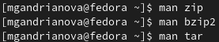
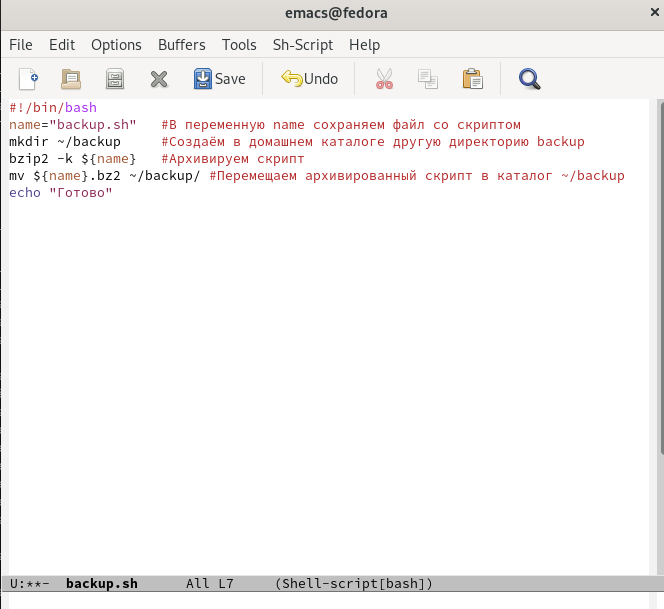
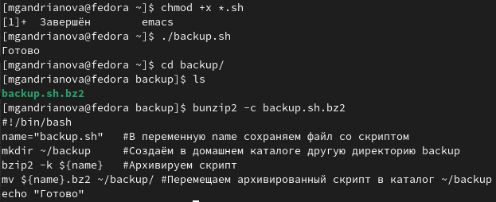
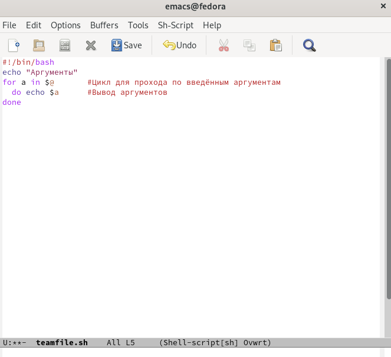
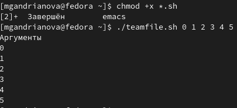
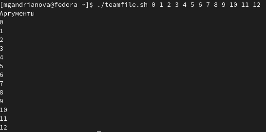
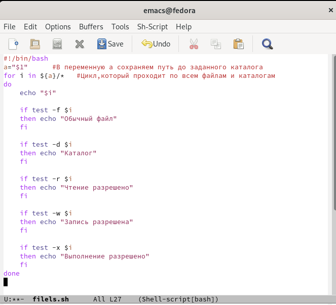
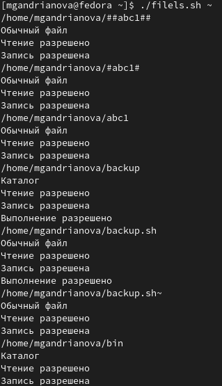
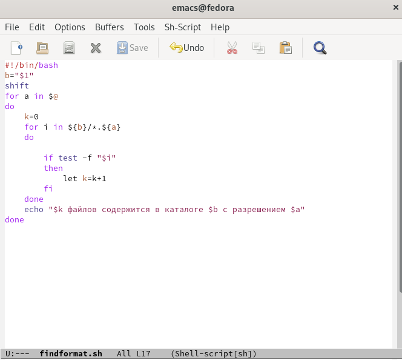
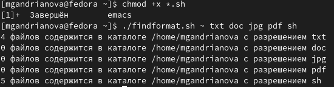

---
## Front matter
lang: ru-RU
title: Лабораторная работа № 10
author: |
	Андрианова Марина Георгиевна
institute: |
	\inst{1}RUDN University, Moscow, Russian Federation

date: NEC--2022, 20 May

## Formatting
toc: false
slide_level: 2
theme: metropolis
header-includes: 
 - \metroset{progressbar=frametitle,sectionpage=progressbar,numbering=fraction}
 - '\makeatletter'
 - '\beamer@ignorenonframefalse'
 - '\makeatother'
aspectratio: 43
section-titles: true
---

# Цель работы

Изучить основы программирования в оболочке ОС UNIX/Linux. Научиться писать небольшие командные файлы.

# Работа с консолью

Сначала я изучила команды архивации, используя команды "man zip","man bzip2","man tar"(рис.1).

{ #fig:001 width=70% }

# Скрипт 1
Скрипт,при запуске делающий резервную копию самого себя (рис.2). 

{ #fig:002 width=70% }

# Скрипт 1
Проверила работу скрипта, до этого добавив для него право на выполнение. Проверила, появился ли каталог backup/, перейдя в него (команда "cd backup/"), посмотрела его содержимое(команда "ls") и просмотрела содержимое архива (команда "bunzip2 -c backup.sh.bz2")(рис.3).Скрипт работает корректно.

{ #fig:003 width=70% }

# Скрипт 2

Пример командного файла, обрабатывающего любое произвольное число аргументов командной строки, в том числе превышающее десять(рис.4).

{ #fig:004 width=70% }

# Скрипт 2

Проверила работу 2 скрипта, до этого добавив для него право на выполнение. Вводила аргументы, количество которых было меньше 10 и больше 10(рис.5,рис.6).

{ #fig:005 width=70% }

{ #fig:006 width=70% }

# Скрипт 3

Скрипт № 3 — аналог команды ls. Он должен выдавать информацию о нужном каталоге и выводить информацию о возможностях доступа к файлам этого каталога(рис.7).

{ #fig:007 width=70% }

# Скрипт 3

Проверила работу 3 скрипта (команда "./filels.sh ~"), до этого добавив для него право на выполнение (команда "chmod +x *.sh").(рис.8). Скрипт работает корректно.

{ #fig:008 width=70% }

# Скрипт 4
Написала командный файл, который получает в качестве аргумента командной строки формат файла (.txt, .doc, .jpg, .pdf и т.д.) и вычисляет количество таких файлов в указанной директории. Путь к директории также передаётся в виде аргумента командной строки(рис.9).

{ #fig:009 width=70% }

# Скрипт 4

Проверила работу 4 скрипта (команда "./findformat.sh ~ txt doc jpg pdf sh"), до этого добавив для него право на выполнение(рис.10). Скрипт работает корректно.

{ #fig:010 width=70% }

# Выводы

Я изучила основы программирования в оболочке ОС UNIX/Linux и научилась писать небольшие командные файлы.

