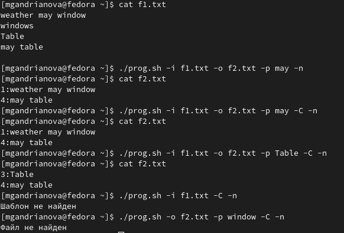
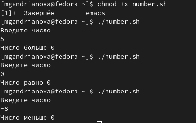
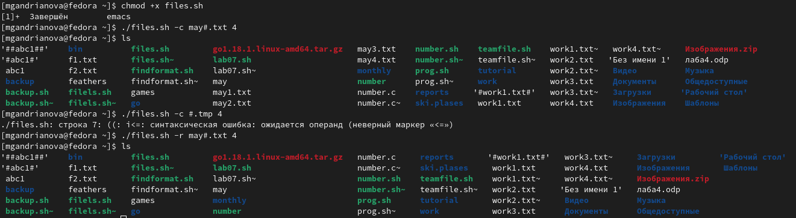
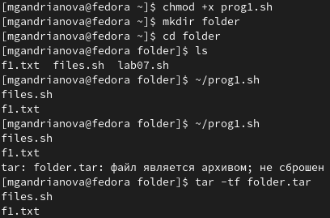
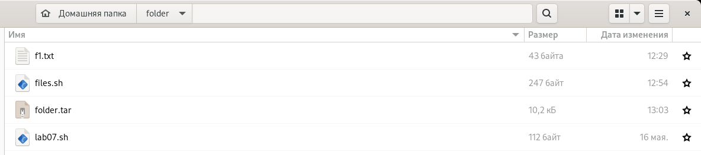

---
## Front matter
lang: ru-RU
title: Лабораторная работа № 11
author: |
	Андрианова Марина Георгиевна
institute: |
	\inst{1}RUDN University, Moscow, Russian Federation
date: NEC--2022, 27 May

## Formatting
toc: false
slide_level: 2
theme: metropolis
header-includes: 
 - \metroset{progressbar=frametitle,sectionpage=progressbar,numbering=fraction}
 - '\makeatletter'
 - '\beamer@ignorenonframefalse'
 - '\makeatother'
aspectratio: 43
section-titles: true
---

# Цель работы

Изучить основы программирования в оболочке ОС UNIX. Научиться писать более сложные командные файлы с использованием логических управляющих конструкций и циклов.

# Выполнение лабораторной работы

1). Используя команды getopts grep, написала командный файл, который анализирует командную строку с ключами:
1.– -iinputfile — прочитать данные из указанного файла;
2.– -ooutputfile — вывести данные в указанный файл;
3.– -pшаблон — указать шаблон для поиска;
4.– -C — различать большие и малые буквы;
5.– -n — выдавать номера строк,а затем ищет в указанном файле нужные строки, определяемые ключом -p.
Для данной задачи я создала файл prog.sh и написала соответствующий скрипт.
Для проверки работоспособности скрипта создала 2 файла, которые необходимы для выполнения программы: f1.txt и f2.txt и добавила право на исполнение файла(команда "chmod +x prog.sh"). Зашла в файл f1.txt и ввела там некоторый текст. Проверила работу написанного скрипта, используя различные опции(рис.1). Скрипт работает корректно.

{ #fig:001 width=70% }

2). Написала на языке Си программу, которая вводит число и определяет, является ли оно больше нуля, меньше нуля или равно нулю. Затем программа завершается с помощью функции exit(n), передавая информацию о коде завершения в оболочку. Командный файл должен вызывать эту программу и, проанализировав с помощью команды $?, выдать сообщение о том, какое число было введено. Для данной задачи я создала 2 файла: number.c и number.sh и написала для них скрипты.
Проверила работу написанных скриптов(команда "./number.sh"), предварительно добавив право на исполнение файла(команда "chmod +x number.sh")(рис.2). Скрипты работают корректно.

{ #fig:002 width=70% }

3). Написала командный файл, создающий указанное число файлов, пронумерованных последовательно от 1 до 𝑁 (например 1.tmp, 2.tmp, 3.tmp,4.tmp и т.д.). Число файлов, которые необходимо создать, передаётся в аргументы командной строки. Этот же командный файл должен уметь удалять все созданные им файлы (если они существуют). Для данной задачи я создала файл-files.sh и написала в нём соответствующий скрипт.
Затем я проверила работу написанного скрипта(команда "./files.sh"), предварительно добавив право на исполнение файла(команда "chmod +x files.sh").Я создала 4 файла(команда "./files.sh -c may#.txt 4"),удовлетворяющие условию задачи, а потом удалила их(команда "./files.sh -r may#.txt 4").Скрипт работает корректно(рис.3).

{ #fig:003 width=70% }

4). Написала командный файл, который с помощью команды tar запаковывает в архив все файлы в указанной директории. Модифицировала его так, чтобы запаковывались только те файлы, которые были изменены менее недели тому назад (использовать команду find). Для данной задачи я создала файл prog1.sh и написала в нём скрипт.
Затем я проверила работу написанного скрипта(команда "tar -tf folder.tar"), предварительно добавив право на исполнение файла(команда "chmod +x prog1.sh").Я создала каталог folder,добавила туда 3 файла: lab07.sh(изменено 16.05.2022), files.sh(изменено 27.05.2022), f1.txt(изменено 27.05.2022).Затем перешла в данный каталог. Как видно из рисунков 15 и 16, файлы,изменённые более недели назад,заархивированы не были. Скрипт работает корректно.

{ #fig:015 width=70% }

{ #fig:016 width=70% }

# Выводы

Я изучила основы программирования в оболочке ОС UNIX и научилась писать более сложные командные файлы с использованием логических управляющих конструкций и циклов.
