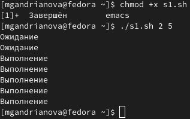
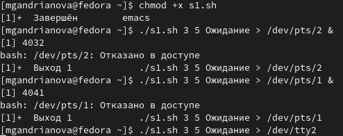
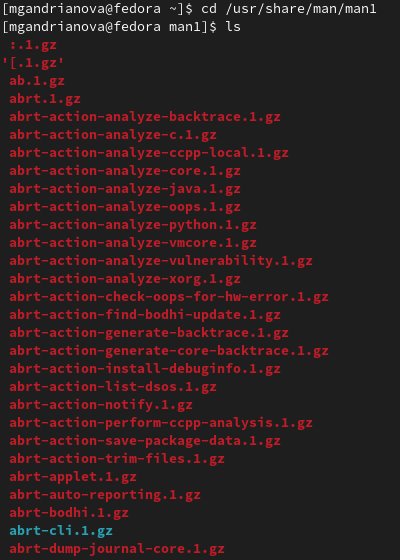
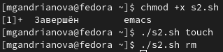
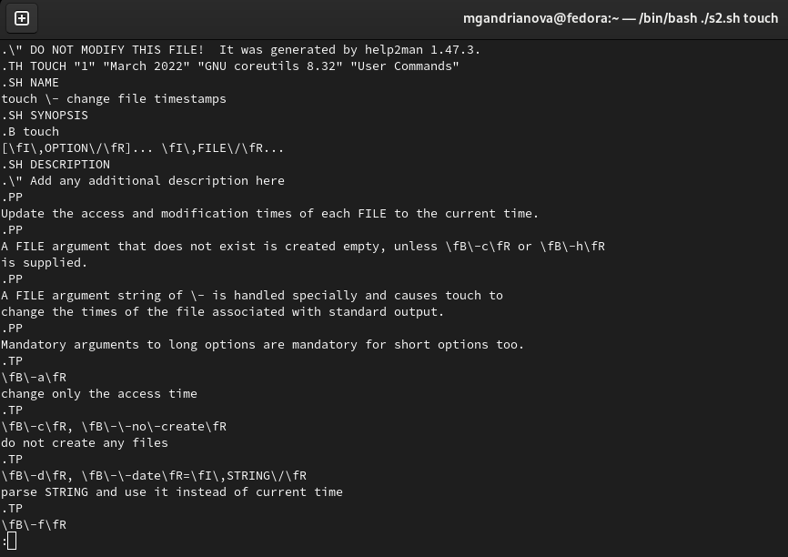
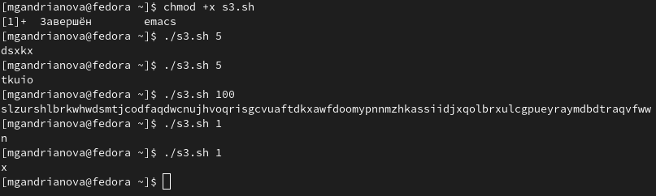

---
## Front matter
lang: ru-RU
title: Лабораторная работа № 12
author: |
	Андрианова Марина Георгиевна
institute: |
	\inst{1}RUDN University, Moscow, Russian Federation
date: NEC--2022, 27 May

## Formatting
toc: false
slide_level: 2
theme: metropolis
header-includes: 
 - \metroset{progressbar=frametitle,sectionpage=progressbar,numbering=fraction}
 - '\makeatletter'
 - '\beamer@ignorenonframefalse'
 - '\makeatother'
aspectratio: 43
section-titles: true
---

# Цель работы

Изучить основы программирования в оболочке ОС UNIX. Научиться писать более
сложные командные файлы с использованием логических управляющих конструкций
и циклов.

# Выполнение лабораторной работы

1). Создала файл s1.sh и написала соответствующий скрипт: командный файл, реализующий упрощённый механизм семафоров. Командный файл должен в течение некоторого времени t1 дожидаться освобождения ресурса, выдавая об этом сообщение, а дождавшись его освобождения, использовать его в течение некоторого времени t2<>t1, также выдавая информацию о том, что ресурс используется соответствующим командным файлом (процессом). 
Проверяем работу написанного скрипта (команда "./s1.sh 2 5"), предварительно добавив право на исполнение файла(команда "chmod +x s1.sh"). Скрипт работает корректно(рис.1).

{ #fig:001 width=70% }

После этого изменяем скрипт так, чтобы его можно было выполнять в нескольких терминалах. Проверила его работу(команда "./s1.sh 3 5 Ожидание > /dev/pts/2 &" и команда "./s1.sh 3 5 Ожидание > /dev/tty2"). При этом ни одна из команд не сработала, выводя сообщение "Отказано в доступе". При этом скрипт работает корректно(рис.2).

{ #fig:002 width=70% }

2). Реализовала команду man с помощью командного файла. Изучила содержимое каталога /usr/share/man/man1:сначала перешла в него командой "cd /usr/share/man/man1",а затем вывела его содержимое(команда "ls")(рис.3). В нем находятся архивы текстовых файлов, содержащих справку по большинству установленных в системе программ и команд. Каждый архив можно открыть командой less сразу же просмотрев содержимое справки. Командный файл должен получать в виде аргумента командной строки название команды и в виде результата выдавать справку об этой команде или сообщение об отсутствии справки, если соответствующего файла нет в каталоге man1.

{ #fig:003 width=70% }

Для данной задачи я создала файл s2.sh и написала соответствующий скрипт.
Проверяем работу написанного скрипта (команды "./s2.sh touch" и "./s2.sh rm"), предварительно добавив право на исполнение файла(команда "chmod +x s2.sh")(рис.4). Скрипт работает корректно(рис.5).

{ #fig:004 width=70% }

{ #fig:005 width=70% }

3). Создала файл s3.sh и написала соответствующий скрипт. Используя встроенную переменную $RANDOM, написала командный файл, генерирующий случайную последовательность букв латинского алфавита. Учтём, что $RANDOM выдаёт псевдослучайные числа в диапазоне от 0 до 32767. Добавила право на исполнение файла(команда "chmod +x s3.sh")(рис.6). Скрипт работает корректно(рис.6).

{ #fig:006 width=70% }

# Выводы

Я изучила основы программирования в оболочке ОС UNIX и научилась писать более сложные командные файлы с использованием логических управляющих конструкций и циклов.
