---
## Front matter
lang: ru-RU
title: Лабораторная работа № 13
author: |
	Андрианова Марина Георгиевна
institute: |
	\inst{1}RUDN University, Moscow, Russian Federation
	
date: NEC--2022, 03 June

## Formatting
toc: false
slide_level: 2
theme: metropolis
header-includes: 
 - \metroset{progressbar=frametitle,sectionpage=progressbar,numbering=fraction}
 - '\makeatletter'
 - '\beamer@ignorenonframefalse'
 - '\makeatother'
aspectratio: 43
section-titles: true
---

# Цель работы

Приобрести простейшие навыки разработки, анализа, тестирования и отладки приложений в ОС типа UNIX/Linux на примере создания на языке программирования С калькулятора с простейшими функциями.

# Выполнение лабораторной работы

1). В домашнем каталоге создадим подкаталог ~/work/os/lab_prog(команда "mkdir ~/work/os/lab_prog")(рис.1).

{ #fig:001 width=70% }

2). Перейдём в созданный подкаталог(команда "cd ~/work/os/lab_prog") и создадим в нём файлы: calculate.h, calculate.c, main.c(команда "touch calculate.h calculate.c main.c ")(рис.2).

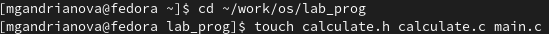{ #fig:002 width=70% }

Это будет примитивнейший калькулятор, способный складывать, вычитать, умножать и делить, возводить число в степень, брать квадратный корень, вычислять sin, cos, tan. При запуске он будет запрашивать первое число, операцию, второе число. После этого программа выведет результат и остановится. 
Запустила редактор Emacs в фоновом режиме(команда "emacs &") и приступила к редактированию созданных файлов.
Реализация функций калькулятора в файле calculate.с.

Интерфейсный файл calculate.h, описывающий формат вызова функции калькулятора(рис.3):

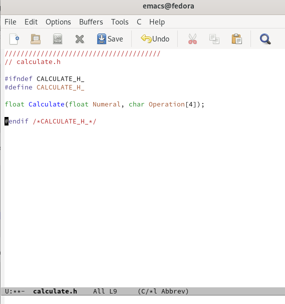{ #fig:003 width=70% }

Основной файл main.c, реализующий интерфейс пользователя к калькулятору(рис.4):

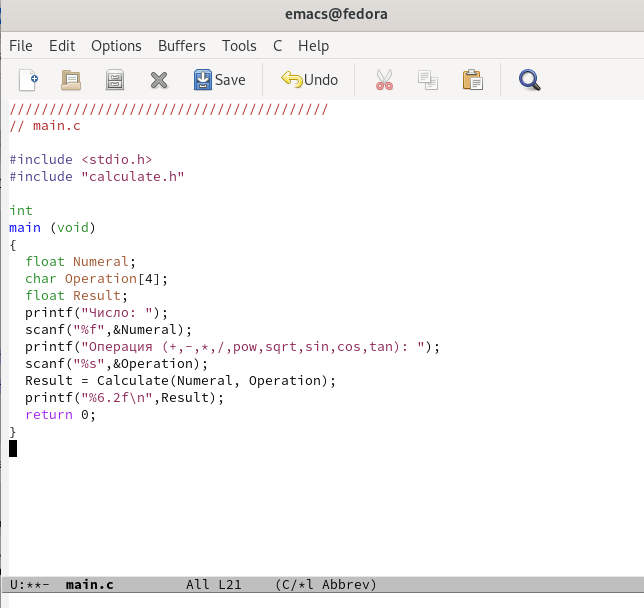{ #fig:004 width=70% }

# Компиляция программы

3). Выполним компиляцию программы посредством gcc, используя команды "gcc -c calculate.c", "gcc -c main.c" и "gcc calculate.o main.o -o calcul -lm"(рис.5).

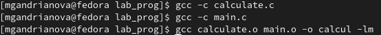{ #fig:005 width=70% }

4). В ходе компиляции программы никаких синтаксических ошибок выявлено не было.
5). Создала Makefile с необходимым содержанием(рис.6).

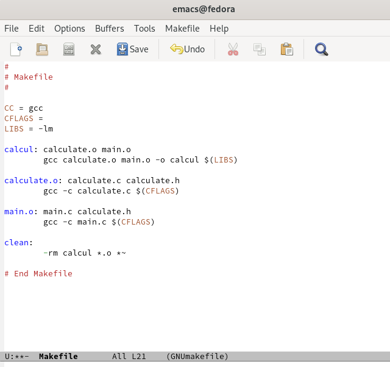{ #fig:006 width=70% }

6). Далее исправила Makefile (рис.7).В переменную CFLAGS добавила опцию -g, необходимую для компиляции объектных файлов и их использования в программе отладчика GDB. Сделала так, что утилита компиляции выбирается с помощью переменной CC.

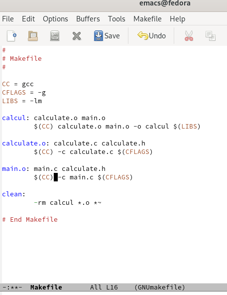{ #fig:007 width=70% }

 После этого я удалила исполняемые и объектные файлы из каталога с помощью команды "make clean" (рис.8). Выполнила компиляцию файлов(рис.9).

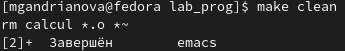{ #fig:010 width=70% }

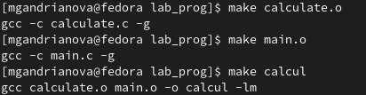{ #fig:009 width=70% }

С помощью gdb выполнила отладку программы calcul:
– Запустила отладчик GDB, загрузив в него программу для отладки, используя команду: "gdb./calcul"(рис.10).

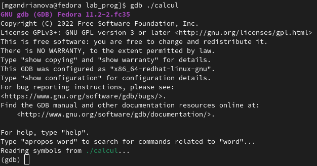{ #fig:010 width=70% }

Для запуска программы внутри отладчика ввела команду "run"(рис.11).

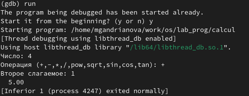{ #fig:011 width=70% }

Установила точку останова в файле calculate.c на строке номер 21, используя команды "list calculate.c:20,27" и "break 21". Вывела информацию об имеющихся в проекте точках останова с помощью команды "info breakpoints"(рис.12).

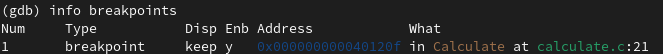{ #fig:012 width=70% }

Запустила программу внутри отладчика и убедилась, что программа остановилась в момент прохождения точки останова. Использовала команды "run", "5","-" и "backtrace".Отладчик выдал следующую информацию(рис.13).

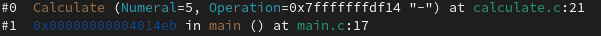{ #fig:013 width=70% }

Посмотрела, чему равно на этом этапе значение переменной Numeral, введя команду "print Numeral"(рис.14).
 
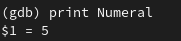{ #fig:014 width=70% }

Сравнила с результатом вывода на экран после использования команды "display Numeral"(рис.15). Значения совпадают. 

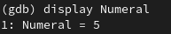{ #fig:015 width=70% }

7).Далее воспользовалась командами "splint calculate.c" и "splint main.c".C помощью утилиты splint выяснилось, что в файлах calculate.c и main.c присутствует функция чтения scanf,возвращающая целое число (тип int), но эти числа не используются и нигде не сохранятся. Утилита вывела предупреждение о том, что в файле calculate.c происходит сравнение вещественного числа с нулем. Также возвращаемые значения (тип double) в функциях pow, sqrt, sin, cos и tan записываются в переменную типа float, что свидетельствует о потери данных.

# Выводы

Я приобрела простейшие навыки разработки, анализа, тестирования и отладки приложений в ОС типа UNIX/Linux на примере создания на языке программирования С калькулятора с простейшими функциями.

