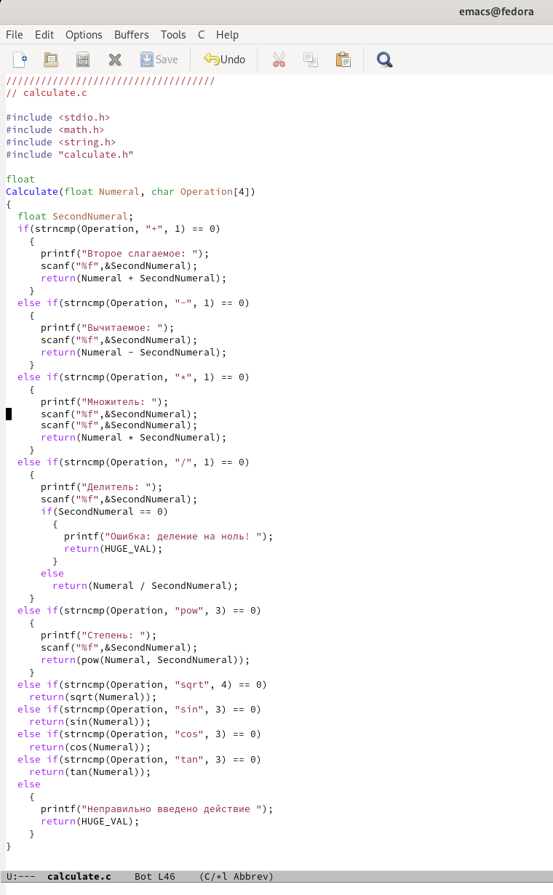

---
## Front matter
lang: ru-RU
title: Лабораторная работа № 13
author: |
	Андрианова Марина Георгиевна
institute: |
	\inst{1}RUDN University, Moscow, Russian Federation
	
date: NEC--2022, 03 June

## Formatting
toc: false
slide_level: 2
theme: metropolis
header-includes: 
 - \metroset{progressbar=frametitle,sectionpage=progressbar,numbering=fraction}
 - '\makeatletter'
 - '\beamer@ignorenonframefalse'
 - '\makeatother'
aspectratio: 43
section-titles: true
---

# Цель работы

Приобрести простейшие навыки разработки, анализа, тестирования и отладки приложений в ОС типа UNIX/Linux на примере создания на языке программирования С калькулятора с простейшими функциями.

# Выполнение лабораторной работы

Реализация функций калькулятора в файле calculate.с(рис.1):

{ #fig:001 width=70% }

Интерфейсный файл calculate.h, описывающий формат вызова функции калькулятора(рис.2):

{ #fig:002 width=70% }

Основной файл main.c, реализующий интерфейс пользователя к калькулятору(рис.3):

{ #fig:003 width=70% }

# 2 пункт 

Создала Makefile с необходимым содержанием(рис.4).

{ #fig:004 width=70% }

# 3 пункт

Далее исправила Makefile (рис.5).

{ #fig:005 width=70% }

В переменную CFLAGS добавила опцию -g, необходимую для компиляции объектных файлов и их использования в программе отладчика GDB. Сделала так, что утилита компиляции выбирается с помощью переменной CC. 

# 4 пункт

 С помощью gdb выполнила отладку программы calcul. Для запуска программы внутри отладчика ввела команду "run"(рис.6).

{ #fig:006 width=70% }

# Выводы

Я приобрела простейшие навыки разработки, анализа, тестирования и отладки приложений в ОС типа UNIX/Linux на примере создания на языке программирования С калькулятора с простейшими функциями.

