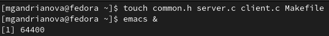
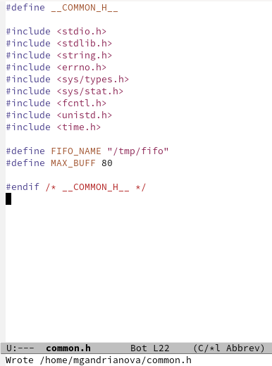
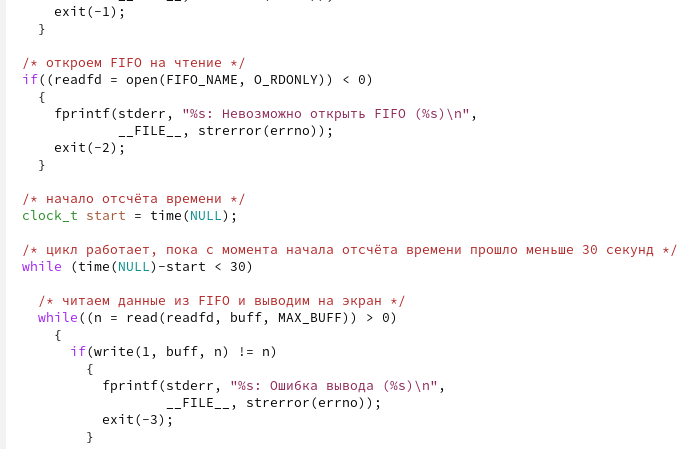
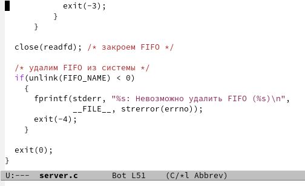
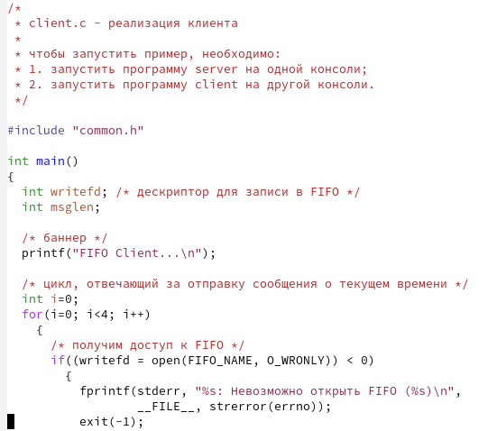
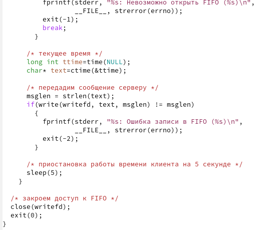
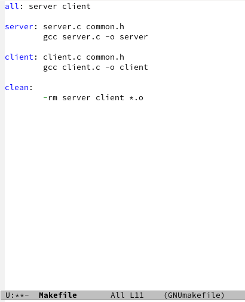
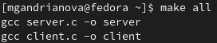
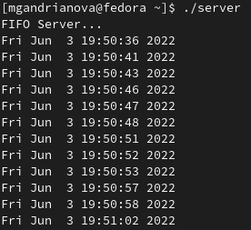

---
## Front matter
lang: ru-RU
title: Лабораторная работа № 14
author: |
	Андрианова Марина Георгиевна
institute: |
	\inst{1}RUDN University, Moscow, Russian Federation
date: NEC--2022, 03 June

## Formatting
toc: false
slide_level: 2
theme: metropolis
header-includes: 
 - \metroset{progressbar=frametitle,sectionpage=progressbar,numbering=fraction}
 - '\makeatletter'
 - '\beamer@ignorenonframefalse'
 - '\makeatother'
aspectratio: 43
section-titles: true
---

# Цель работы

Приобретение практических навыков работы с именованными каналами.

# Создание файлов

1). Создала необходимые файлы с помощью команды "touch common.h server.c client.c Makefile" и открыла редактор Emacs в фоновом режиме для их редактирования(рис.1).

{ #fig:001 width=70% }

# Изменение кода common.h

2). Изменила коды программ, представленных в тексте лабораторной работы.В файл common.h добавляем стандартные заголовочные файлы unistd.h и time.h, необходимые для работы кодов других файлов. Сommon.h предназначен для заголовочных файлов, чтобы в остальных программах их не прописывать каждый раз(рис.2).

{ #fig:002 width=70% }

# Изменение кода server.c

3). В файл server.c добавила цикл while для контроля времени работы сервера. Разница между текущим временем time(NULL) и временем начала работы clock_t start=time(NULL)(инициализация до цикла) не должна превышать 30 секунд(рис.3,рис.4).

{ #fig:003 width=70% }

{ #fig:004 width=70% }

# Изменение кода client.c

4). В файл client.c добавила цикл, который отвечает за количество сообщений о текущем времени, которое получается в результате выполнения команд(/* текущее время */) и команду sleep(5) для приостановления работы клиента на 5 секунд(рис.5,рис.6).

{ #fig:006 width=70% }

{ #fig:007 width=70% }

# Makefile

5). Makefile(для сборки) не изменяем(рис.7).

{ #fig:007 width=70% }

# Компиляция файлов

6). После написания кодов ввела команду "make all" для компиляции необходимых файлов(рис.8).

{ #fig:008 width=70% }

# Проверка написанного кода

7). Далее проверила работу написанного кода. Открыла 3 консоли(терминала) и запустила: в первом терминале - "./server", в остальных двух - "./client". В результате каждый терминал-клиент вывел по 4 сообщения. Спустя 30 секунд работа сервера была прекращена. Программа работает корректно(рис.9,рис.10).

{ #fig:009 width=70% }

{ #fig:010 width=70% }

# Выводы

Я приобрела практические навыки работы с именованными каналами.
