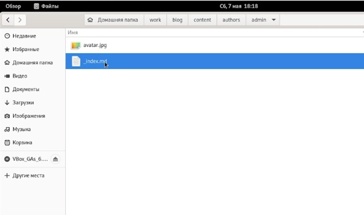
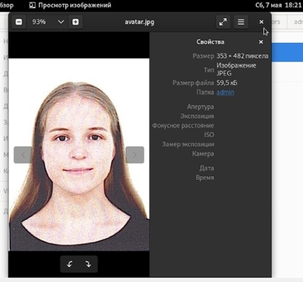
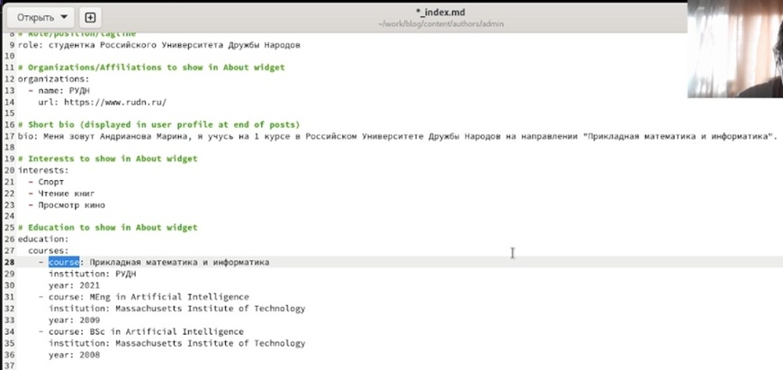
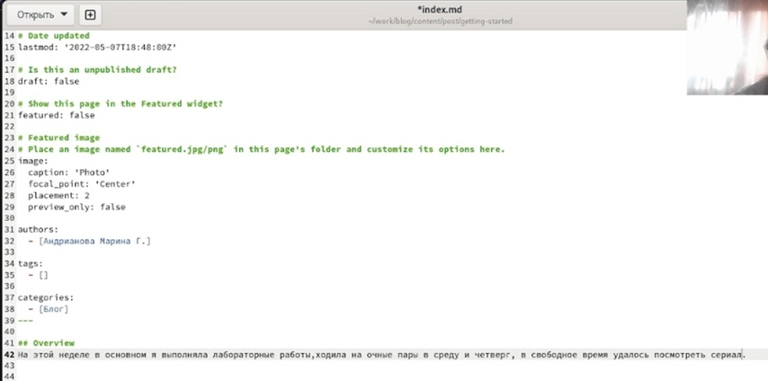
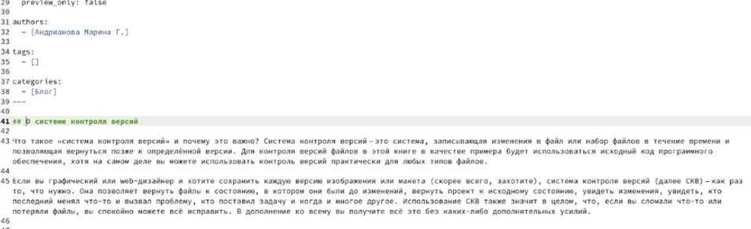
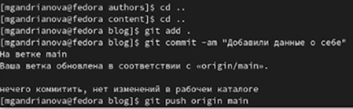
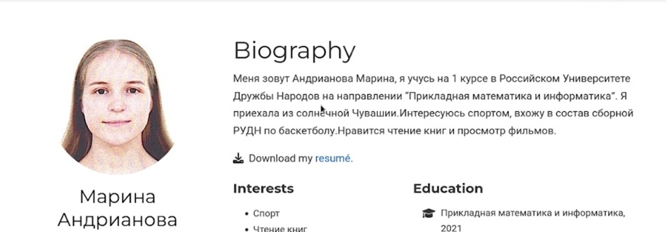
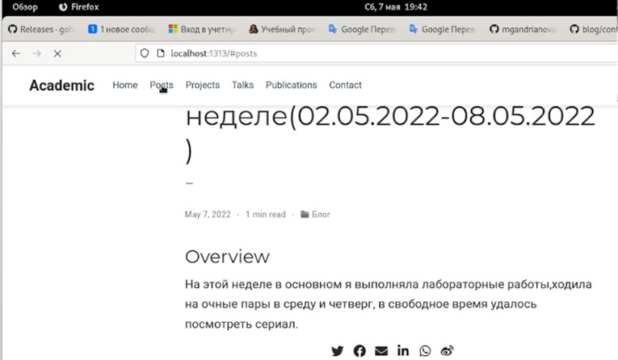
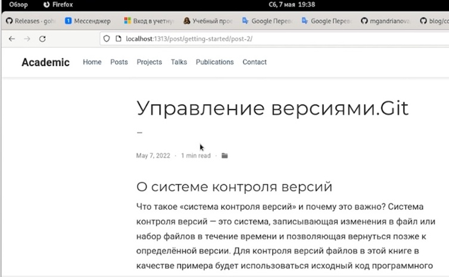

---
## Front matter
lang: ru-RU
title: Индивидуальный проект, 2 этап
author: |
	Андрианова Марина Георгиевна
institute: |
	\inst{1}RUDN University, Moscow, Russian Federation
	
date: NEC--2022, 07 May

## Formatting
toc: false
slide_level: 2
theme: metropolis
header-includes: 
 - \metroset{progressbar=frametitle,sectionpage=progressbar,numbering=fraction}
 - '\makeatletter'
 - '\beamer@ignorenonframefalse'
 - '\makeatother'
aspectratio: 43
section-titles: true
---


## Цель этапа
Добавить к сайту данные о себе.
        Разместить фотографию владельца сайта.
        Разместить краткое описание владельца сайта (Biography).
        Добавить информацию об интересах (Interests).
        Добавить информацию об образовании (Education).
    Сделать пост по прошедшей неделе.
    Добавить пост на тему по выбору :
        Управление версиями. Git.
        Непрерывная интеграция и непрерывное развертывание (CI/CD).

## Выполнение

1. Заходим в папку work/blog/content/authors/admin.(рис.1)

{ #fig:001 width=70% }

## Выполнение

2. Загрузим своё фото(рис.2) под названием avatar.jpg.

{ #fig:002 width=70% }

## Выполнение

3. Зайдем в файл _index.md и начнём добавлять о себе информацию:биографию, интересы и образование(рис.3).

{ #fig:003 width=70% }

## Выполнение

4. В папке work/blog/content/post/getting-started зайдём в файл _index.md(позже я переименую этот файл на "post № 1") и начнём оформлять пост по прошедшей неделе(рис.4).

{ #fig:004 width=70% }

## Выполнение

5. В эту же папку скопируем файл _index.md(позже я переименую этот файл на "post № 2") и зайдём в него,начнём оформлять пост на тему: "Управление версиями.Git"(рис.5).

{ #fig:005 width=70% }

## Выполнение

6. Чтобы сохранить изменения и отправить на GitHub, введём команды(рис.6):
``` language
	1. git add .
	2. git commit -am ""
	3. git push origin main
```

{ #fig:006 width=70% }

## Выполнение

7. В папке work/blog введём команду "hugo server", терминал выдаст нам ссылку на наш сайт,копируем её и вставляем в браузер. Как можно заметить, перед нами появится фото и биография(рис.7).

{ #fig:007 width=70% }

## Выполнение

8. Пост по прошедшей неделе(рис.8) и пост на тему: "Управление версиями.Git"(рис.9) тоже загрузились.

{ #fig:008 width=70% }

{ #fig:009 width=70% }

## Выводы
1. Я добавила к сайту данные о себе:
        Разместила свою фотографию.
        Разместила краткое описание владельца сайта (Biography).
        Добавила информацию об интересах (Interests).
        Добавила информацию об образовании (Education).
2. Сделала пост по прошедшей неделе.
3. Добавила пост на тему:
        "Управление версиями. Git."
