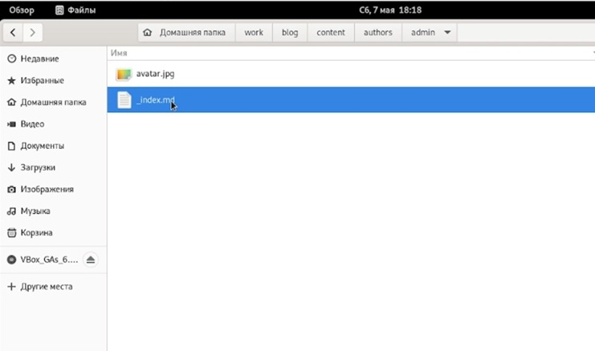
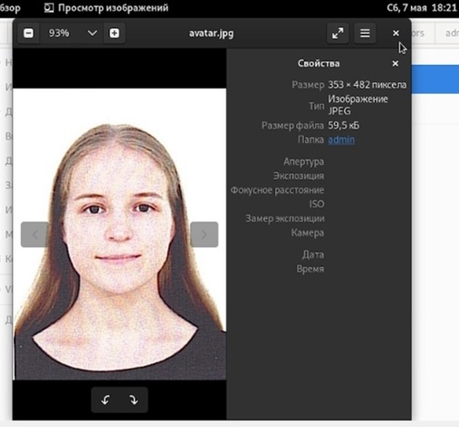
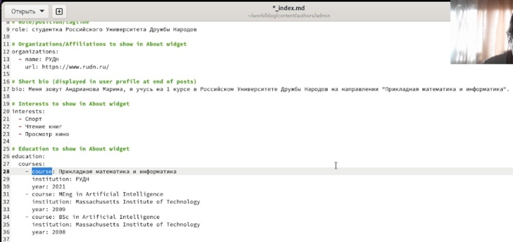
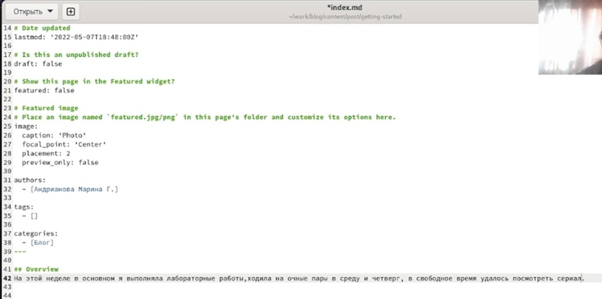
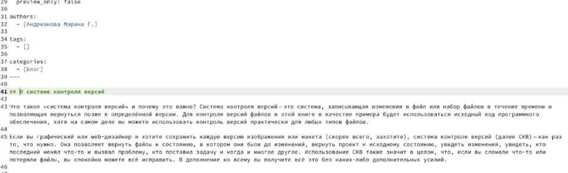
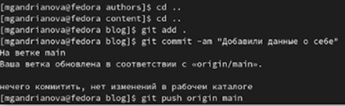
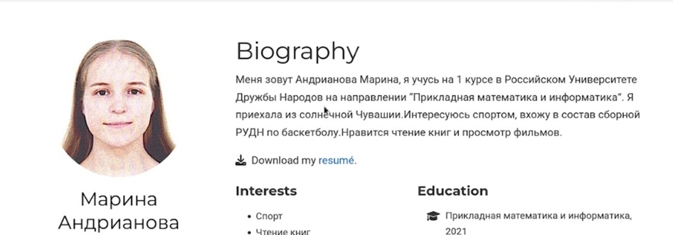
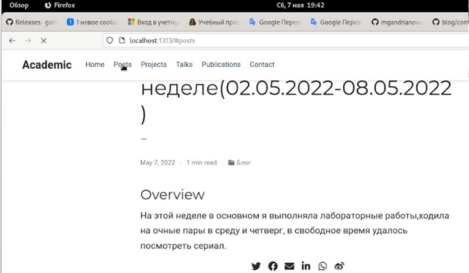
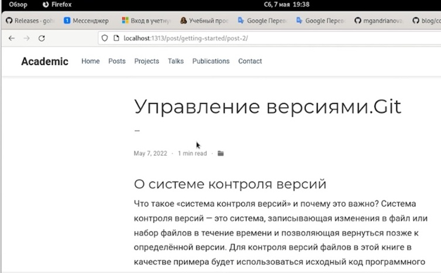

---
## Front matter
title: "Отчёт по 2 этапу индивидуального проекта"
subtitle: "*дисциплина:* Операционные системы"
author: "Андрианова Марина Георгиевна"

## Generic otions
lang: ru-RU
toc-title: "Содержание"

## Bibliography
bibliography: bib/cite.bib
csl: pandoc/csl/gost-r-7-0-5-2008-numeric.csl

## Pdf output format
toc: true # Table of contents
toc-depth: 2
lof: true # List of figures
lot: true # List of tables
fontsize: 12pt
linestretch: 1.5
papersize: a4
documentclass: scrreprt
## I18n polyglossia
polyglossia-lang:
  name: russian
  options:
	- spelling=modern
	- babelshorthands=true
polyglossia-otherlangs:
  name: english
## I18n babel
babel-lang: russian
babel-otherlangs: english
## Fonts
mainfont: PT Serif
romanfont: PT Serif
sansfont: PT Sans
monofont: PT Mono
mainfontoptions: Ligatures=TeX
romanfontoptions: Ligatures=TeX
sansfontoptions: Ligatures=TeX,Scale=MatchLowercase
monofontoptions: Scale=MatchLowercase,Scale=0.9
## Biblatex
biblatex: true
biblio-style: "gost-numeric"
biblatexoptions:
  - parentracker=true
  - backend=biber
  - hyperref=auto
  - language=auto
  - autolang=other*
  - citestyle=gost-numeric
## Pandoc-crossref LaTeX customization
figureTitle: "Рис."
tableTitle: "Таблица"
listingTitle: "Листинг"
lofTitle: "Список иллюстраций"
lotTitle: "Список таблиц"
lolTitle: "Листинги"
## Misc options
indent: true
header-includes:
  - \usepackage{indentfirst}
  - \usepackage{float} # keep figures where there are in the text
  - \floatplacement{figure}{H} # keep figures where there are in the text
---

# Цель работы

Добавить к сайту данные о себе.

    Список добавляемых данных.
        Разместить фотографию владельца сайта.
        Разместить краткое описание владельца сайта (Biography).
        Добавить информацию об интересах (Interests).
        Добавить информацию об образовании (Education).
    Сделать пост по прошедшей неделе.
    Добавить пост на тему по выбору :
        Управление версиями. Git.
        Непрерывная интеграция и непрерывное развертывание (CI/CD).


# Выполнение 

1. Заходим в папку work/blog/content/authors/admin.(рис.1)

{ #fig:001 width=70% }

2. Загрузим своё фото(рис.2) под названием avatar.jpg.

{ #fig:002 width=70% }

3. Зайдем в файл _index.md и начнём добавлять о себе информацию:биографию, интересы и образование(рис.3).

{ #fig:003 width=70% }

4. В папке work/blog/content/post/getting-started зайдём в файл _index.md(позже я переименую этот файл на "post № 1") и начнём оформлять пост по прошедшей неделе(рис.4).

{ #fig:004 width=70% }

5. В эту же папку скопируем файл _index.md(позже я переименую этот файл на "post № 2") и зайдём в него,начнём оформлять пост на тему: "Управление версиями.Git"(рис.5).

{ #fig:005 width=70% }

6. Чтобы сохранить изменения и отправить на GitHub, введём команды(рис.6):
``` language
	1. git add .
	2. git commit -am ""
	3. git push origin main
```

{ #fig:006 width=70% }

7. В папке work/blog введём команду "hugo server", терминал выдаст нам ссылку на наш сайт,копируем её и вставляем в браузер. Как можно заметить, перед нами появится фото и биография(рис.7).

{ #fig:007 width=70% }

8. Пост по прошедшей неделе(рис.8) и пост на тему: "Управление версиями.Git"(рис.9) тоже загрузились.

{ #fig:008 width=70% }

{ #fig:009 width=70% }

# Выводы

1. Я добавила к сайту данные о себе:
        Разместила свою фотографию.
        Разместила краткое описание владельца сайта (Biography).
        Добавила информацию об интересах (Interests).
        Добавила информацию об образовании (Education).
2. Сделала пост по прошедшей неделе.
3. Добавила пост на тему:
        "Управление версиями. Git."
        

