---
## Front matter
lang: ru-RU
title: Индивидуальный проект,3 этап.
author: |
	Андрианова Марина Георгиевна\inst{1}
institute: |
	\inst{1}RUDN University, Moscow, Russian Federation
date: NEC--2022, 14 May

## Formatting
toc: false
slide_level: 2
theme: metropolis
header-includes: 
 - \metroset{progressbar=frametitle,sectionpage=progressbar,numbering=fraction}
 - '\makeatletter'
 - '\beamer@ignorenonframefalse'
 - '\makeatother'
aspectratio: 43
section-titles: true
---

# Цель работы

Добавить к сайту достижения.

# Задание

1)Добавить информацию о навыках (Skills).
2)Добавить информацию об опыте (Experience).
3)Добавить информацию о достижениях (Accomplishments).
4)Сделать пост по прошедшей неделе.
5)Добавить пост на тему по выбору:
        Легковесные языки разметки.
        Языки разметки. LaTeX.
        Язык разметки Markdown.

# Выполнение 

1). Сначала заходим в каталог work/blog/content/home, там видим необходимые нам файлы: skills.md, experience.md, accomplishments.md (рис.1).Редактируем файлы и вносим свои навыки, информацию об опыте,свои достижения.

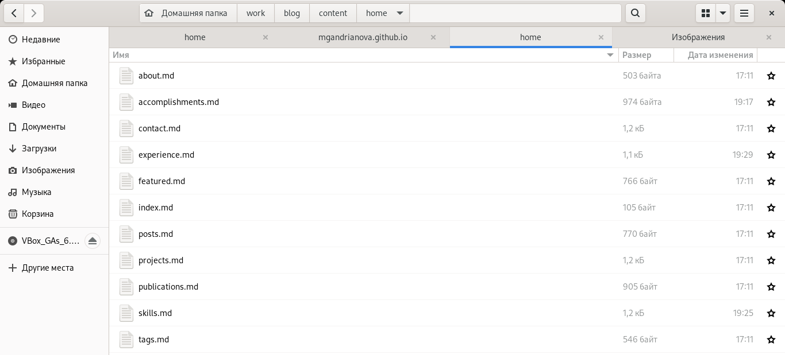{ #fig:001 width=70% }

2). Переходим в каталог work/blog/content/post/getting-started для добавления постов(рис.2).

{ #fig:002 width=70% }

Проверяем созданные файлы(рис.3).

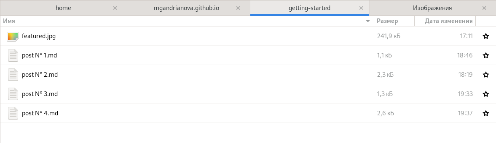{ #fig:003 width=70% }

3). Ввела в терминале в каталоге ~/work/blog команды(рис.4) для загрузки созданных файлов на GitHub:
``` language
git add .
git commit -am "Добавили к сайту достижения"
git push origin main
```
Затем ввела команду "~/bin/hugo"(рис.4):

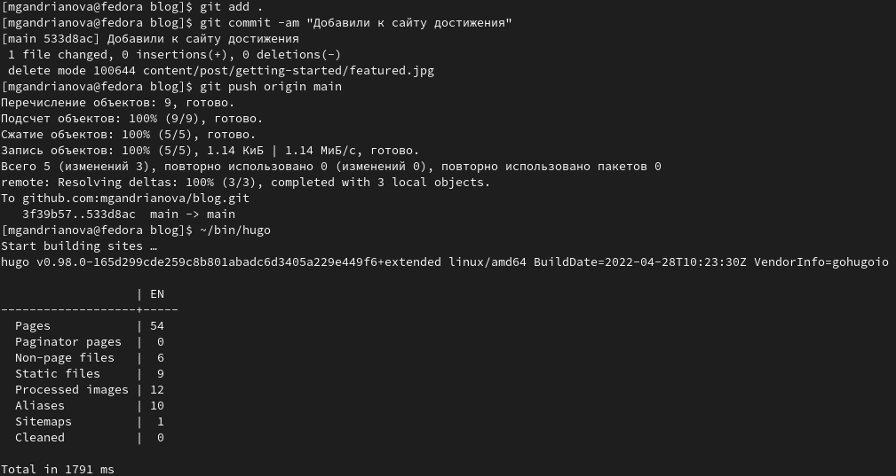{ #fig:004 width=70% }

Ввела команду "~/bin/hugo server"(рис.5).

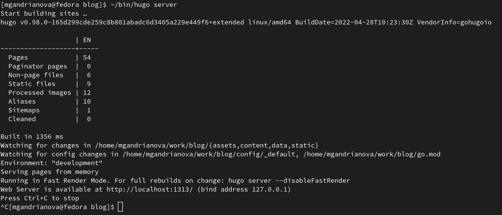{ #fig:005 width=70% }

Терминал выведет на экран ссылку нашего сайта: http://localhost:1313/ . Копируем её в браузер и переходим по ней.
4). Проверяем выполненные действия:
Мои навыки(рис.6).

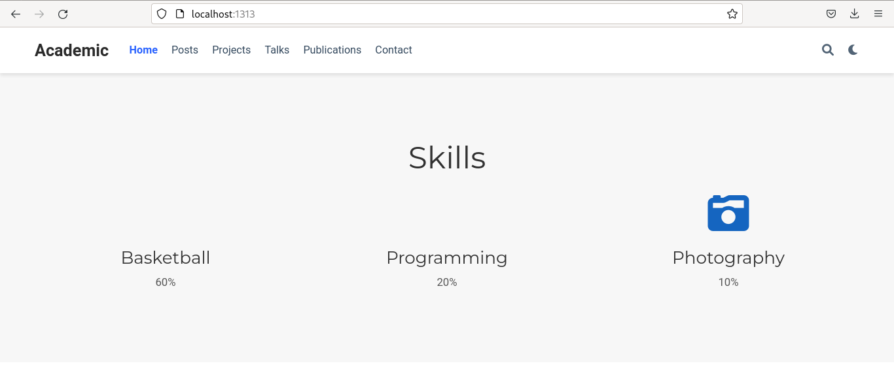{ #fig:006 width=70% }

Мой опыт(рис.7).

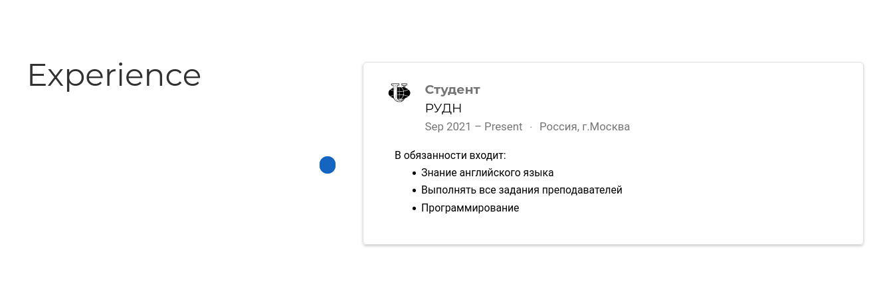{ #fig:007 width=70% }

Мои достижения(рис.8).

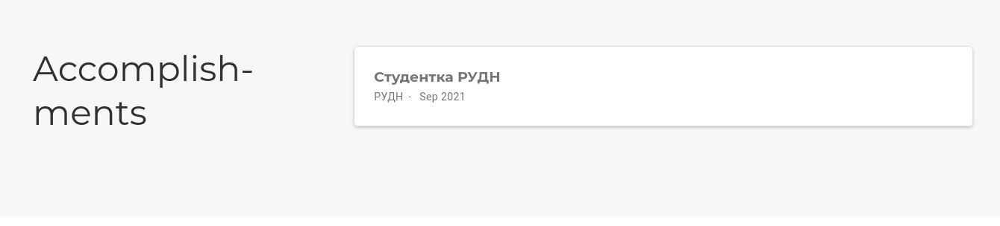{ #fig:008 width=70% }

5).Проверяем созданные посты(рис.9):

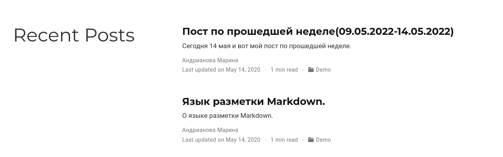{ #fig:009 width=70% }

Пост по прошедшей неделе(рис.10).

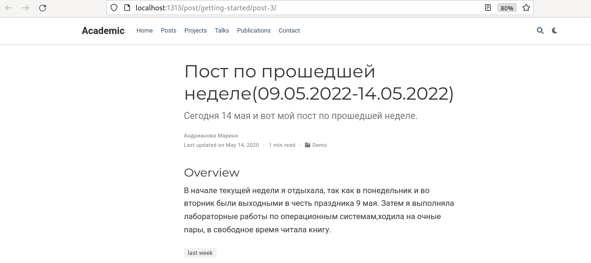{ #fig:010 width=70% }

Пост на тему: "Язык разметки Markdown"(рис.11,рис.12).

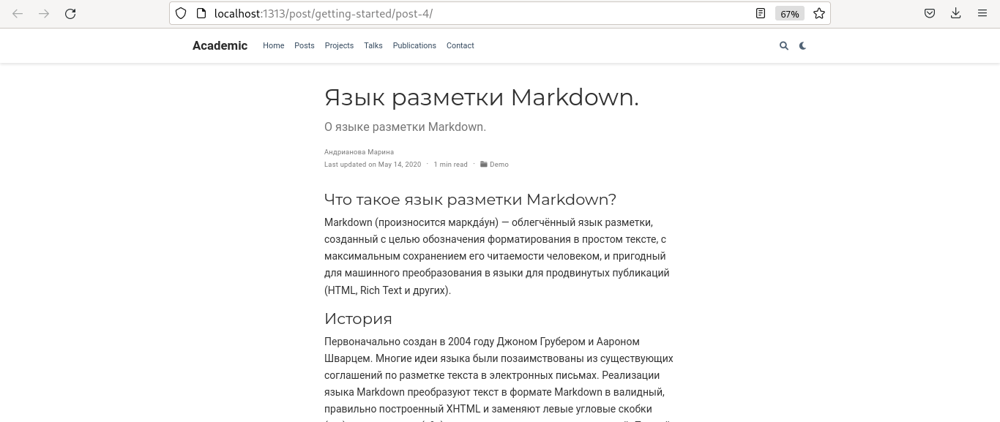{ #fig:011 width=70% }

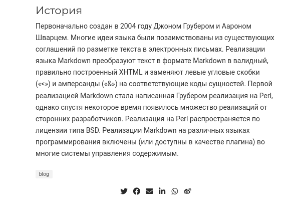{ #fig:012 width=70% }

# Выводы

1)Добавила информацию о навыках (Skills).
2)Добавила информацию об опыте (Experience).
3)Добавила информацию о достижениях (Accomplishments).
4)Сделала пост по прошедшей неделе.
5)Добавила пост на тему: "Язык разметки Markdown".


