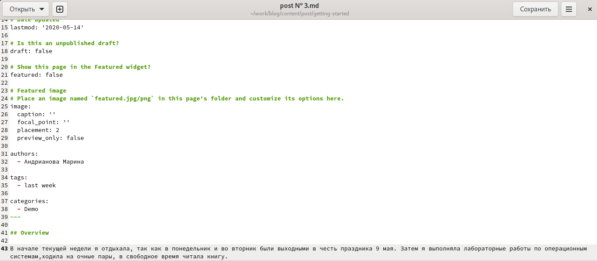

---
## Front matter
title: "Отчёт по индивидуальному проекту,3 этап."
subtitle: "*дисциплина:* Операционные системы"
author: "Андрианова Марина Георгиевна"

## Generic otions
lang: ru-RU
toc-title: "Содержание"

## Bibliography
bibliography: bib/cite.bib
csl: pandoc/csl/gost-r-7-0-5-2008-numeric.csl

## Pdf output format
toc: true # Table of contents
toc-depth: 2
lof: true # List of figures
lot: true # List of tables
fontsize: 12pt
linestretch: 1.5
papersize: a4
documentclass: scrreprt
## I18n polyglossia
polyglossia-lang:
  name: russian
  options:
	- spelling=modern
	- babelshorthands=true
polyglossia-otherlangs:
  name: english
## I18n babel
babel-lang: russian
babel-otherlangs: english
## Fonts
mainfont: PT Serif
romanfont: PT Serif
sansfont: PT Sans
monofont: PT Mono
mainfontoptions: Ligatures=TeX
romanfontoptions: Ligatures=TeX
sansfontoptions: Ligatures=TeX,Scale=MatchLowercase
monofontoptions: Scale=MatchLowercase,Scale=0.9
## Biblatex
biblatex: true
biblio-style: "gost-numeric"
biblatexoptions:
  - parentracker=true
  - backend=biber
  - hyperref=auto
  - language=auto
  - autolang=other*
  - citestyle=gost-numeric
## Pandoc-crossref LaTeX customization
figureTitle: "Рис."
tableTitle: "Таблица"
listingTitle: "Листинг"
lofTitle: "Список иллюстраций"
lotTitle: "Список таблиц"
lolTitle: "Листинги"
## Misc options
indent: true
header-includes:
  - \usepackage{indentfirst}
  - \usepackage{float} # keep figures where there are in the text
  - \floatplacement{figure}{H} # keep figures where there are in the text
---

# Цель работы

Добавить к сайту достижения.

# Задание

1)Добавить информацию о навыках (Skills).
2)Добавить информацию об опыте (Experience).
3)Добавить информацию о достижениях (Accomplishments).
4)Сделать пост по прошедшей неделе.
5)Добавить пост на тему по выбору:
        Легковесные языки разметки.
        Языки разметки. LaTeX.
        Язык разметки Markdown.

# Выполнение 

1). Сначала заходим в каталог work/blog/content/home, там видим необходимые нам файлы для редактирования: skills.md, experience.md, accomplishments.md (рис.1).

{ #fig:001 width=70% }

Переходим в файл skills.md и вносим в него свои навыки(рис.2).

{ #fig:002 width=70% }

Переходим в файл experience.md и вносим туда информацию об опыте(рис.3).

{ #fig:003 width=70% }

Переходим в файл accomplishments.md и записываем свои достижения(рис.4).

{ #fig:004 width=70% }

2). Переходим в каталог work/blog/content/post/getting-started для добавления постов(рис.5).

{ #fig:005 width=70% }

Пишем пост по прошедшей неделе в файле "post № 3.md"(рис.6).

{ #fig:006 width=70% }

Пишем пост на тему: "Язык разметки Markdown" в файле "post № 4.md"(рис.7).

{ #fig:007 width=70% }

Проверяем созданные файлы(рис.8).

{ #fig:008 width=70% }

3). Ввела в терминале в каталоге ~/work/blog команды(рис.9) для загрузки созданных файлов на GitHub:
``` language
git add .
git commit -am "Добавили к сайту достижения"
git push origin main
```
Затем ввела команду "~/bin/hugo"(рис.9):

{ #fig:009 width=70% }

Ввела команду "~/bin/hugo server"(рис.10).

{ #fig:010 width=70% }

Терминал выведет на экран ссылку нашего сайта: http://localhost:1313/ . Копируем её в браузер и переходим по ней.
4). Проверяем выполненные действия:
Мои навыки(рис.11).

{ #fig:011 width=70% }

Мой опыт(рис.12).

{ #fig:012 width=70% }

Мои достижения(рис.13).

{ #fig:013 width=70% }

5).Проверяем созданные посты(рис.14):

{ #fig:014 width=70% }

Пост по прошедшей неделе(рис.15).

{ #fig:015 width=70% }

Пост на тему: "Язык разметки Markdown"(рис.16,рис.17).

{ #fig:016 width=70% }

{ #fig:017 width=70% }

# Выводы

1)Добавила информацию о навыках (Skills).
2)Добавила информацию об опыте (Experience).
3)Добавила информацию о достижениях (Accomplishments).
4)Сделала пост по прошедшей неделе.
5)Добавила пост на тему: "Язык разметки Markdown".
