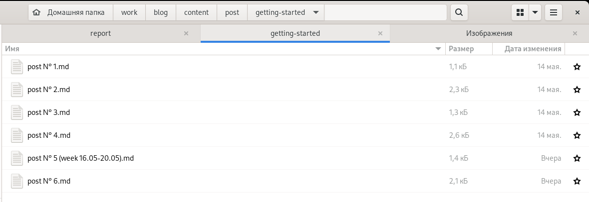
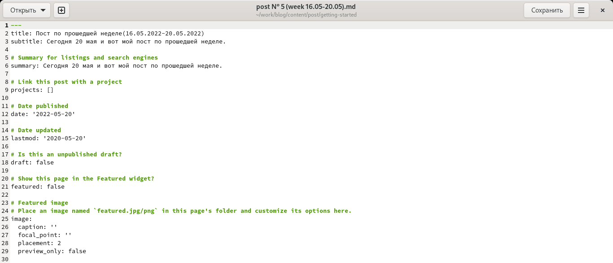
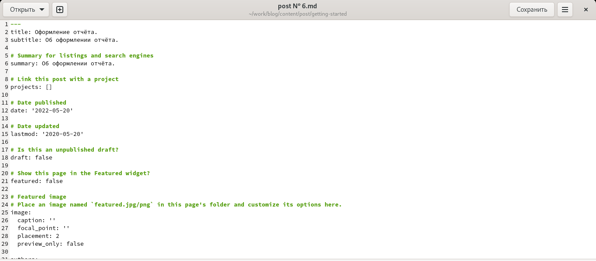
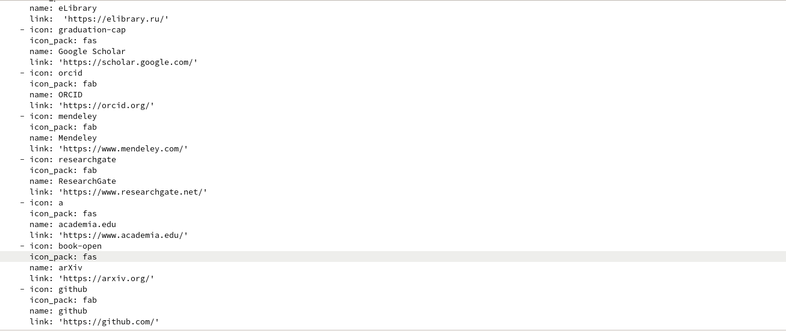
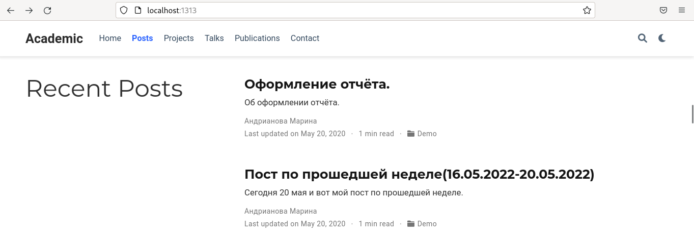
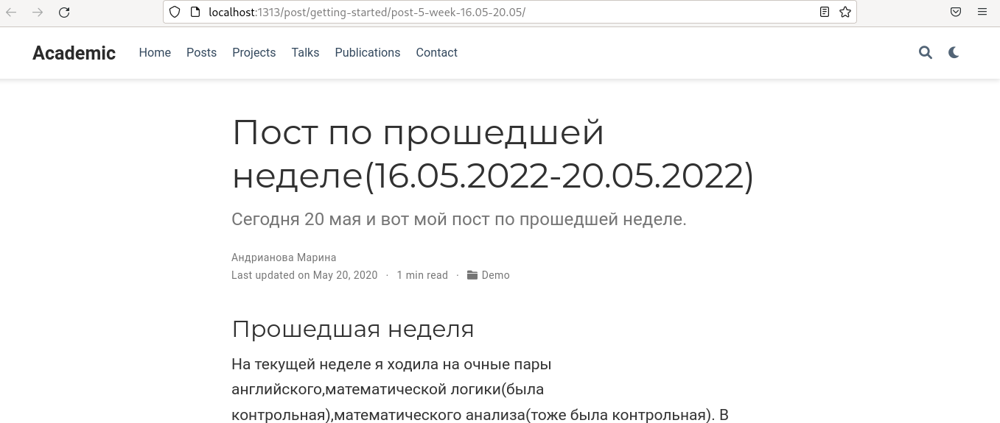
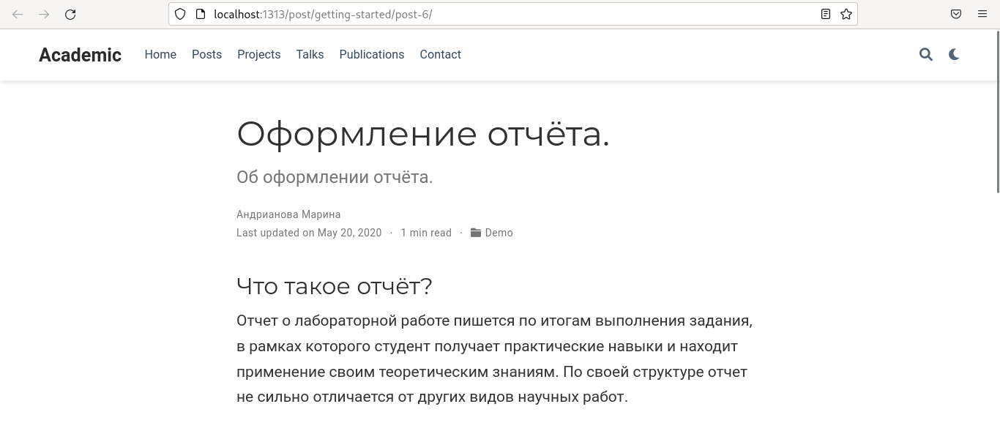
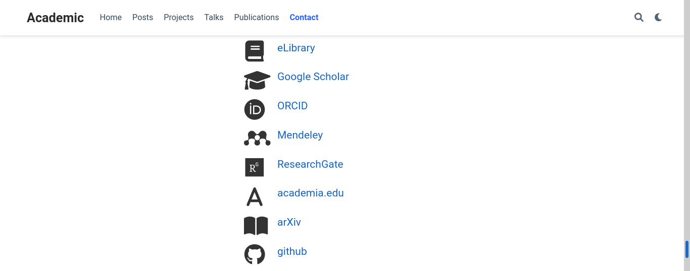

---
## Front matter
lang: ru-RU
title: Индивидуальный проект,4 этап.
author: |
	Андрианова Марина Георгиевна\inst{1}
institute: |
	\inst{1}RUDN University, Moscow, Russian Federation
date: NEC--2022, 21 May

## Formatting
toc: false
slide_level: 2
theme: metropolis
header-includes: 
 - \metroset{progressbar=frametitle,sectionpage=progressbar,numbering=fraction}
 - '\makeatletter'
 - '\beamer@ignorenonframefalse'
 - '\makeatother'
aspectratio: 43
section-titles: true
---

# Цель работы

Добавить к сайту ссылки на научные и библиометрические ресурсы.

# Задание

-Зарегистрироваться на соответствующих ресурсах и разместить на них ссылки на сайте:
eLibrary : https://elibrary.ru/;
Google Scholar : https://scholar.google.com/;
ORCID : https://orcid.org/;
Mendeley : https://www.mendeley.com/;
ResearchGate : https://www.researchgate.net/;
Academia.edu : https://www.academia.edu/;
arXiv : https://arxiv.org/;
github : https://github.com/.
-Сделать пост по прошедшей неделе.
-Добавить пост на тему по выбору:
	Оформление отчёта.
	Создание презентаций.
	Работа с библиографией.
	
# Выполнение 
1). Сначала заходим в каталог work/blog/content/post/getting-started для добавления постов(рис.1).

{ #fig:001 width=70% }

Сначала редактируем 5 пост(пост по прошедшей неделе)(рис.2).

{ #fig:002 width=70% }

Затем редактируем 6 пост(пост по теме "Оформление отчёта")(рис.3).

{ #fig:003 width=70% }

2). Переходим в каталог work/blog/content/home, там видим необходимый нам файл для редактирования: contact.md.Редактируем его(рис.4).

{ #fig:004 width=70% }

3). Ввела в терминале в каталоге ~/work/blog команды для загрузки созданных файлов на GitHub:
``` language
git add .
git commit -am "Stage № 4"
git push origin main
```
Затем ввела команду "~/bin/hugo" и команду "~/bin/hugo server".
Терминал выведет на экран ссылку нашего сайта: http://localhost:1313/ . Копируем её в браузер и переходим по ней.
4). Проверяем выполненные действия:
2 поста(рис.5).

{ #fig:005 width=70% }

5 пост(по прошедшей неделе) на сайте(рис.6).

{ #fig:006 width=70% }

6 пост(по теме)(рис.7).

{ #fig:007 width=70% }

5).Проверяем ссылки на сайте(рис.8).

{ #fig:008 width=70% }

# Выводы

-Я зарегистрировалась на соответствующих ресурсах и разместила на них ссылки на сайте:
eLibrary : https://elibrary.ru/;
Google Scholar : https://scholar.google.com/;
ORCID : https://orcid.org/;
Mendeley : https://www.mendeley.com/;
ResearchGate : https://www.researchgate.net/;
Academia.edu : https://www.academia.edu/;
arXiv : https://arxiv.org/;
github : https://github.com/.
-Сделала пост по прошедшей неделе.
-Добавила пост на тему: "Оформление отчёта".
	

