---
## Front matter
title: "Отчёт по индивидуальному проекту,4 этап."
subtitle: "*дисциплина:* Операционные системы"
author: "Андрианова Марина Георгиевна"

## Generic otions
lang: ru-RU
toc-title: "Содержание"

## Bibliography
bibliography: bib/cite.bib
csl: pandoc/csl/gost-r-7-0-5-2008-numeric.csl

## Pdf output format
toc: true # Table of contents
toc-depth: 2
lof: true # List of figures
lot: true # List of tables
fontsize: 12pt
linestretch: 1.5
papersize: a4
documentclass: scrreprt
## I18n polyglossia
polyglossia-lang:
  name: russian
  options:
	- spelling=modern
	- babelshorthands=true
polyglossia-otherlangs:
  name: english
## I18n babel
babel-lang: russian
babel-otherlangs: english
## Fonts
mainfont: PT Serif
romanfont: PT Serif
sansfont: PT Sans
monofont: PT Mono
mainfontoptions: Ligatures=TeX
romanfontoptions: Ligatures=TeX
sansfontoptions: Ligatures=TeX,Scale=MatchLowercase
monofontoptions: Scale=MatchLowercase,Scale=0.9
## Biblatex
biblatex: true
biblio-style: "gost-numeric"
biblatexoptions:
  - parentracker=true
  - backend=biber
  - hyperref=auto
  - language=auto
  - autolang=other*
  - citestyle=gost-numeric
## Pandoc-crossref LaTeX customization
figureTitle: "Рис."
tableTitle: "Таблица"
listingTitle: "Листинг"
lofTitle: "Список иллюстраций"
lotTitle: "Список таблиц"
lolTitle: "Листинги"
## Misc options
indent: true
header-includes:
  - \usepackage{indentfirst}
  - \usepackage{float} # keep figures where there are in the text
  - \floatplacement{figure}{H} # keep figures where there are in the text
---

# Цель работы

Добавить к сайту ссылки на научные и библиометрические ресурсы.

# Задание

-Зарегистрироваться на соответствующих ресурсах и разместить на них ссылки на сайте:
eLibrary : https://elibrary.ru/;
Google Scholar : https://scholar.google.com/;
ORCID : https://orcid.org/;
Mendeley : https://www.mendeley.com/;
ResearchGate : https://www.researchgate.net/;
Academia.edu : https://www.academia.edu/;
arXiv : https://arxiv.org/;
github : https://github.com/.
-Сделать пост по прошедшей неделе.
-Добавить пост на тему по выбору:
	Оформление отчёта.
	Создание презентаций.
	Работа с библиографией.

# Выполнение лабораторной работы

1). Сначала заходим в каталог work/blog/content/post/getting-started для добавления постов(рис.1).

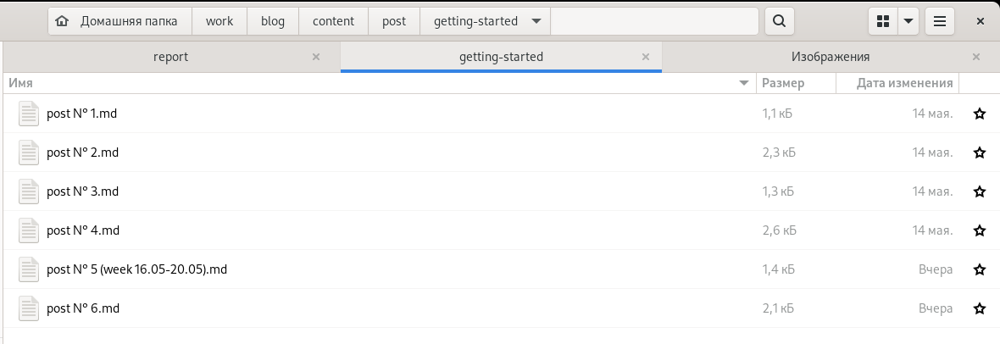{ #fig:001 width=70% }

Сначала редактируем 5 пост(пост по прошедшей неделе)(рис.2,рис.3).

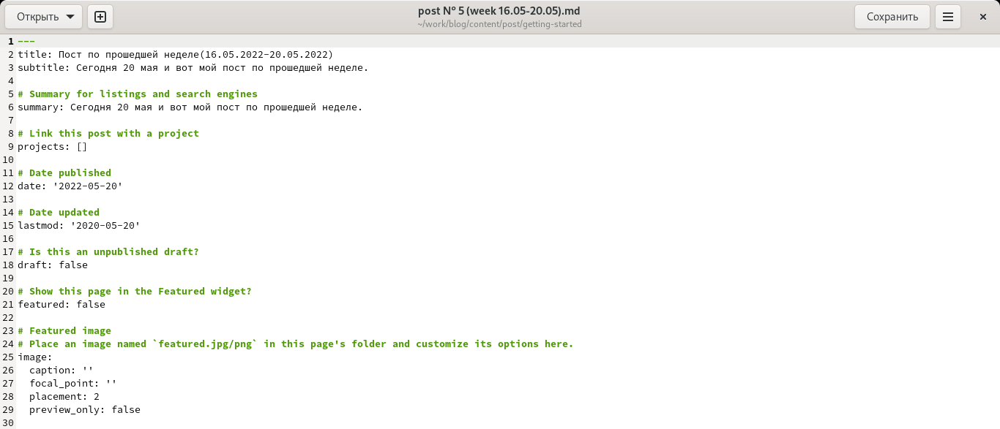{ #fig:002 width=70% }

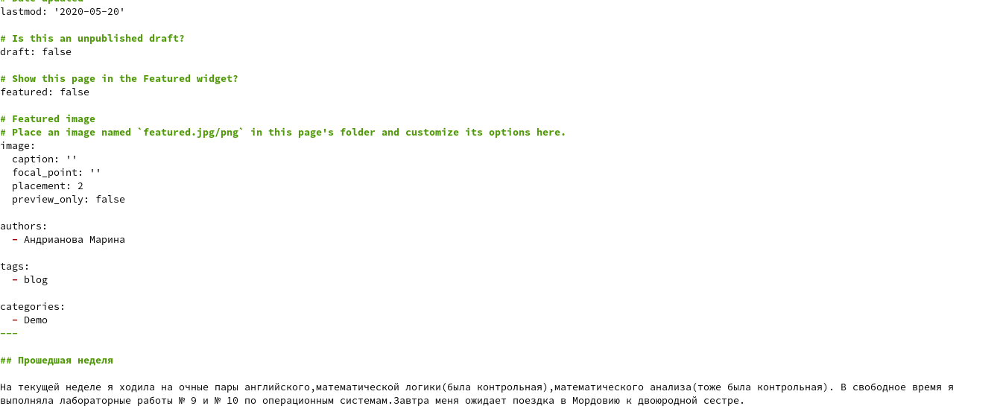{ #fig:003 width=70% }

Затем редактируем 6 пост(пост по теме "Оформление отчёта")(рис.4,рис.5).

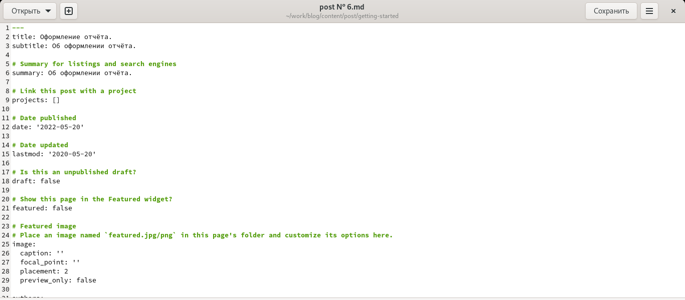{ #fig:004 width=70% }

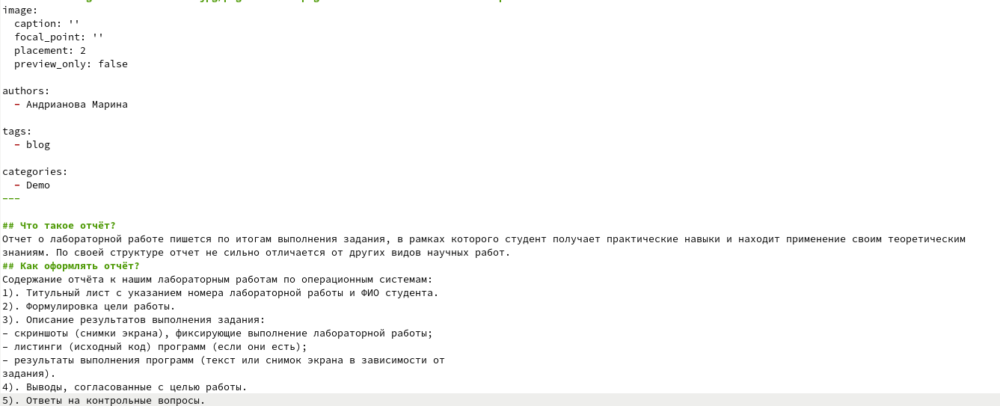{ #fig:005 width=70% }

2). Переходим в каталог work/blog/content/home, там видим необходимый нам файл для редактирования: contact.md(рис.6).

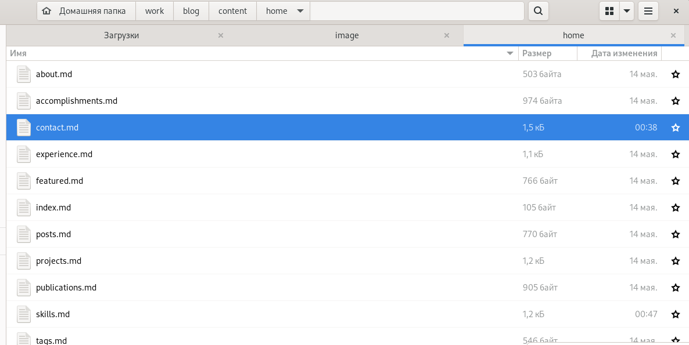{ #fig:006 width=70% }

Редактируем файл contact.md(рис.7).

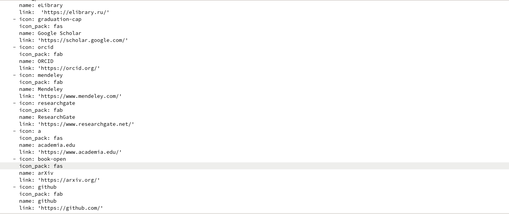{ #fig:007 width=70% }

3). Ввела в терминале в каталоге ~/work/blog команды для загрузки созданных файлов на GitHub:
``` language
git add .
git commit -am "Добавили к сайту достижения"
git push origin main
```
Затем ввела команду "~/bin/hugo" и команду "~/bin/hugo server".
Терминал выведет на экран ссылку нашего сайта: http://localhost:1313/ . Копируем её в браузер и переходим по ней.
4). Проверяем выполненные действия:
2 поста(рис.8).

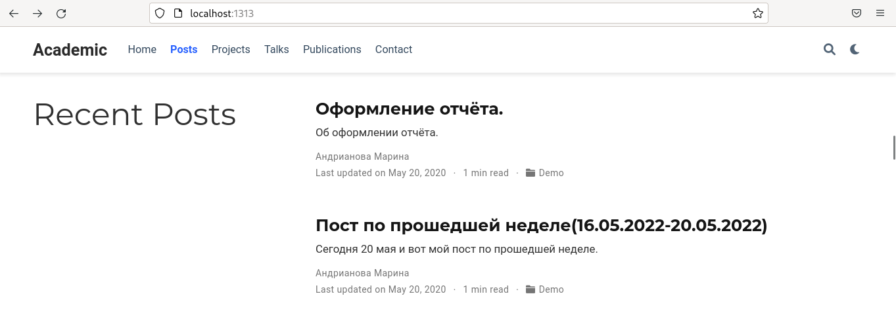{ #fig:008 width=70% }

5 пост(по прошедшей неделе) на сайте(рис.9,рис.10).

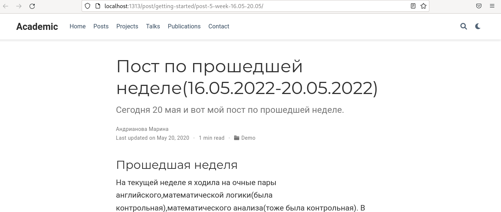{ #fig:009 width=70% }

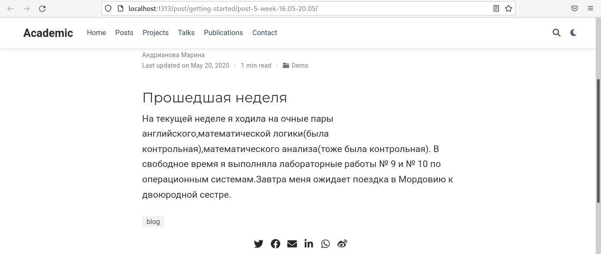{ #fig:010 width=70% }

6 пост(по теме)(рис.11,рис.12).

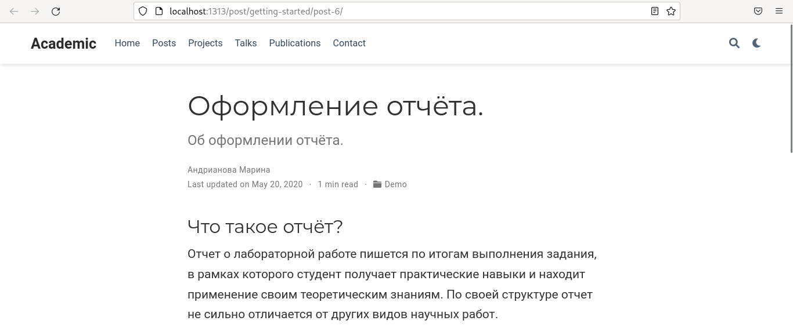{ #fig:011 width=70% }

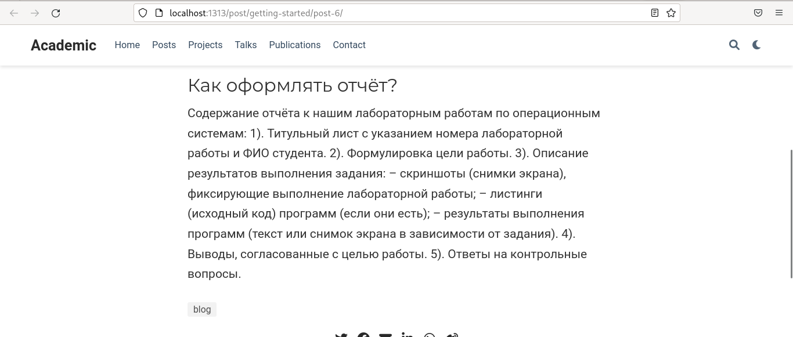{ #fig:012 width=70% }

5).Проверяем ссылки на сайте(рис.13,рис.14).

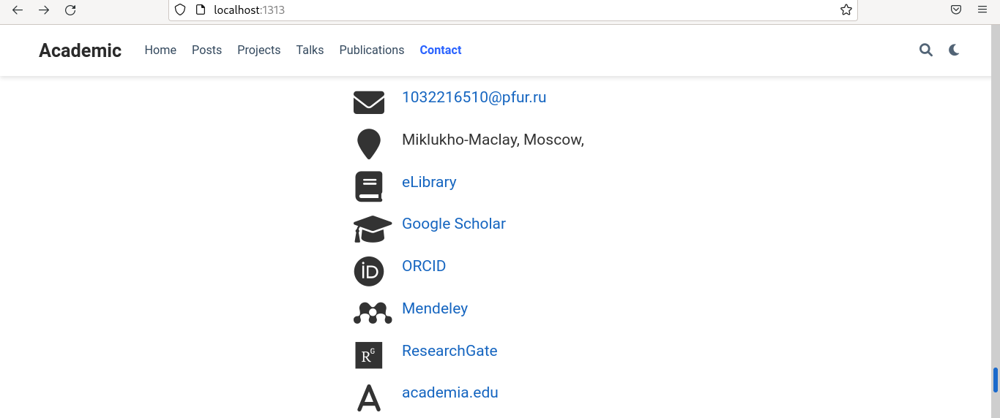{ #fig:013 width=70% }

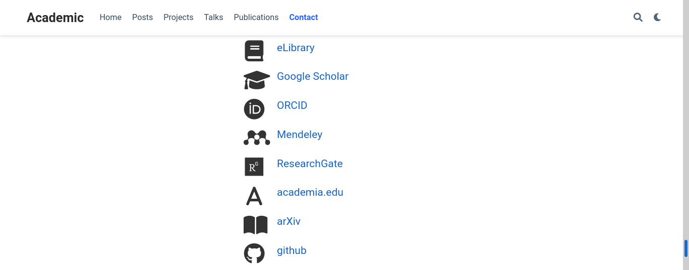{ #fig:014 width=70% }

# Выводы

-Я зарегистрировалась на соответствующих ресурсах и разместила на них ссылки на сайте:
eLibrary : https://elibrary.ru/;
Google Scholar : https://scholar.google.com/;
ORCID : https://orcid.org/;
Mendeley : https://www.mendeley.com/;
ResearchGate : https://www.researchgate.net/;
Academia.edu : https://www.academia.edu/;
arXiv : https://arxiv.org/;
github : https://github.com/.
-Сделала пост по прошедшей неделе.
-Добавила пост на тему: "Оформление отчёта".
	
