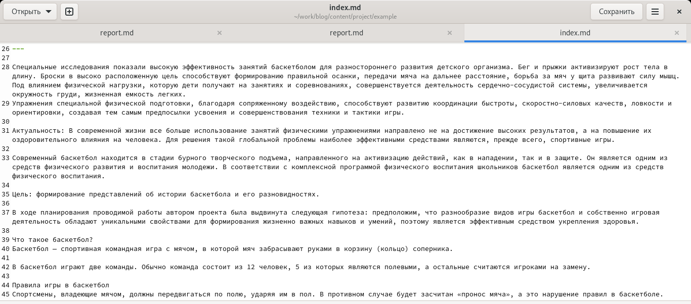
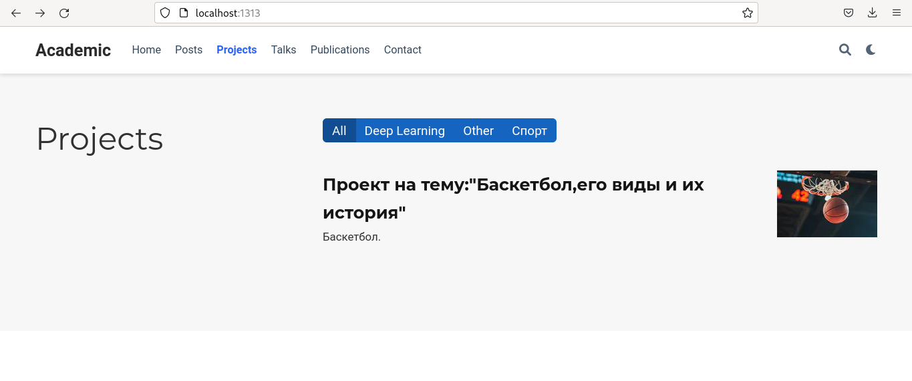
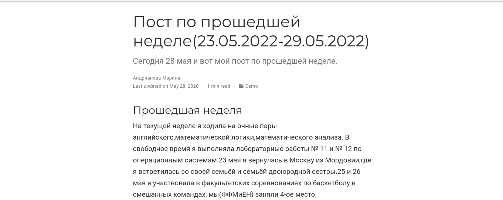
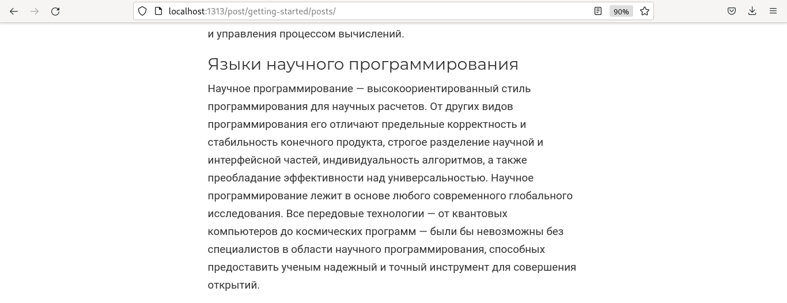
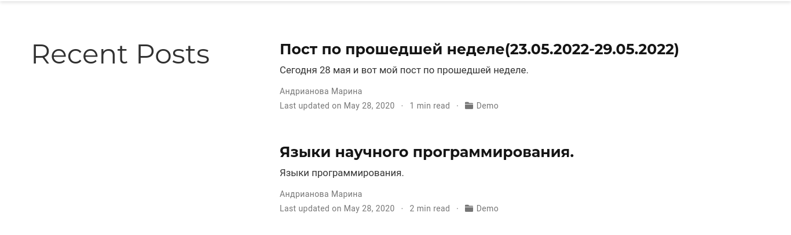

---
## Front matter
lang: ru-RU
title: Индивидуальный проект,5 этап.
author: |
	Андрианова Марина Георгиевна
institute: |
	\inst{1}RUDN University, Moscow, Russian Federation
	
date: NEC--2022, 28 May

## Formatting
toc: false
slide_level: 2
theme: metropolis
header-includes: 
 - \metroset{progressbar=frametitle,sectionpage=progressbar,numbering=fraction}
 - '\makeatletter'
 - '\beamer@ignorenonframefalse'
 - '\makeatother'
aspectratio: 43
section-titles: true
---

# Цель работы

Добавить к сайту все остальные элементы.

Сделать записи для персональных проектов.
Сделать пост по прошедшей неделе.
Добавить пост на тему по выбору.
Языки научного программирования.


# Выполнение лабораторной работы

1). Переходим в каталог work/blog/content/project/example, там видим необходимый нам файл для редактирования: index.md.Редактируем его(рис.1).

{ #fig:001 width=70% }

2). Затем заходим в каталог work/blog/content/post/getting-started для добавления постов.
Редактируем 7 пост(пост по прошедшей неделе).Затем редактируем 8 пост по теме "Языки научного программирования".

# Работа в терминале

3). Ввела в терминале в каталоге ~/work/blog команды для загрузки созданных файлов на GitHub:
``` language
git add .
git commit -am "Добавили к сайту всё остальное"
git push origin main
```
Затем ввела команду "~/bin/hugo" и команду "~/bin/hugo server".
Терминал выведет на экран ссылку нашего сайта: http://localhost:1313/ . Копируем её в браузер и переходим по ней.

# Проверка выполненных действий

4). Проверяем выполненные действия:
Персональный проект на сайте(рис.2).

{ #fig:002 width=70% }

7 пост(по прошедшей неделе) на сайте(рис.3).

{ #fig:003 width=70% }

8 пост(по теме)(рис.4).

{ #fig:004 width=70% }

2 поста на сайте(рис.5).

{ #fig:005 width=70% }

# Выводы

Я добавила к сайту все остальные элементы.
Сделала записи для персональных проектов.
Сделала пост по прошедшей неделе(23.05-29.05).
Добавила пост на тему: "Языки научного программирования".
