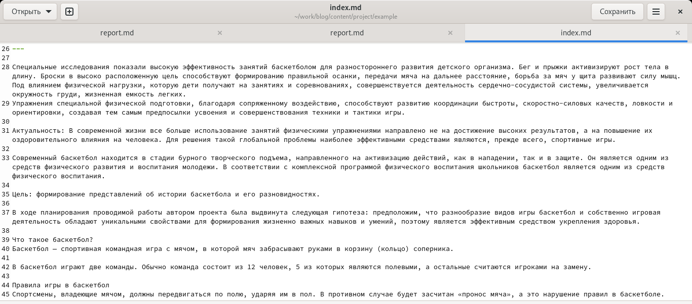
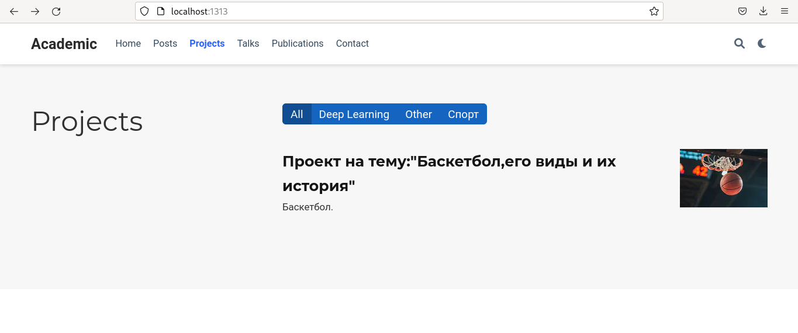
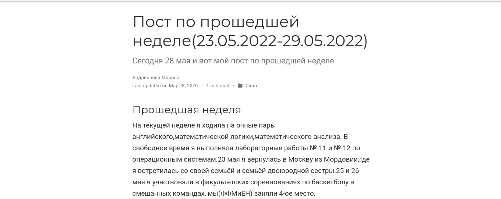
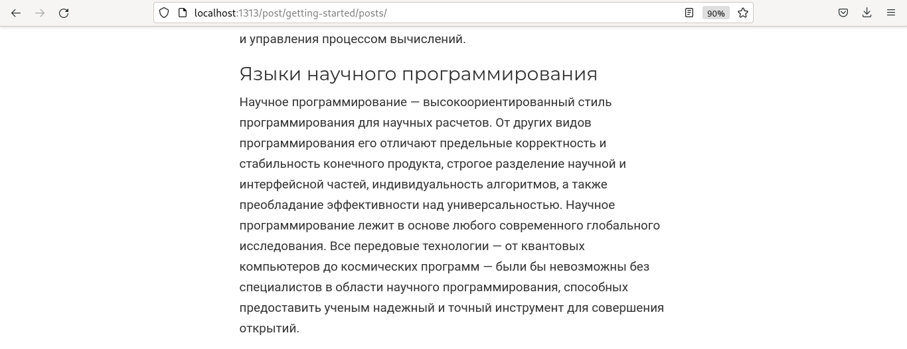
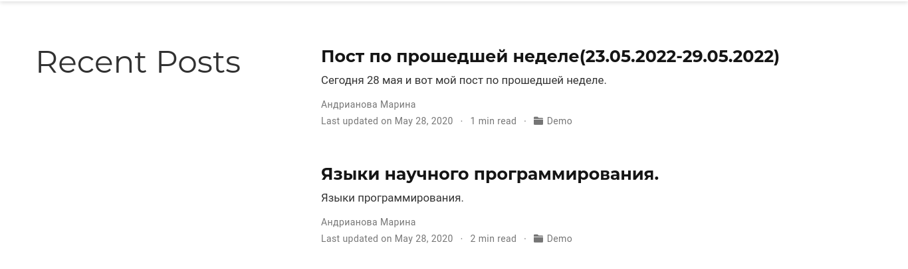

---
## Front matter
title: "Отчёт по индивидуальному проекту,5 этап."
subtitle: "*дисциплина:* Операционные системы"
author: "Андрианова Марина Георгиевна"

## Generic otions
lang: ru-RU
toc-title: "Содержание"

## Bibliography
bibliography: bib/cite.bib
csl: pandoc/csl/gost-r-7-0-5-2008-numeric.csl

## Pdf output format
toc: true # Table of contents
toc-depth: 2
lof: true # List of figures
lot: true # List of tables
fontsize: 12pt
linestretch: 1.5
papersize: a4
documentclass: scrreprt
## I18n polyglossia
polyglossia-lang:
  name: russian
  options:
	- spelling=modern
	- babelshorthands=true
polyglossia-otherlangs:
  name: english
## I18n babel
babel-lang: russian
babel-otherlangs: english
## Fonts
mainfont: PT Serif
romanfont: PT Serif
sansfont: PT Sans
monofont: PT Mono
mainfontoptions: Ligatures=TeX
romanfontoptions: Ligatures=TeX
sansfontoptions: Ligatures=TeX,Scale=MatchLowercase
monofontoptions: Scale=MatchLowercase,Scale=0.9
## Biblatex
biblatex: true
biblio-style: "gost-numeric"
biblatexoptions:
  - parentracker=true
  - backend=biber
  - hyperref=auto
  - language=auto
  - autolang=other*
  - citestyle=gost-numeric
## Pandoc-crossref LaTeX customization
figureTitle: "Рис."
tableTitle: "Таблица"
listingTitle: "Листинг"
lofTitle: "Список иллюстраций"
lotTitle: "Список таблиц"
lolTitle: "Листинги"
## Misc options
indent: true
header-includes:
  - \usepackage{indentfirst}
  - \usepackage{float} # keep figures where there are in the text
  - \floatplacement{figure}{H} # keep figures where there are in the text
---

# Цель работы

Добавить к сайту все остальные элементы.

Сделать записи для персональных проектов.
Сделать пост по прошедшей неделе.
Добавить пост на тему по выбору.
Языки научного программирования.


# Выполнение лабораторной работы

1). Переходим в каталог work/blog/content/project/example, там видим необходимый нам файл для редактирования: index.md.Редактируем его(рис.1).

{ #fig:001 width=70% }

2). Затем заходим в каталог work/blog/content/post/getting-started для добавления постов.
Редактируем 7 пост(пост по прошедшей неделе).Затем редактируем 8 пост по теме "Языки научного программирования".
3). Ввела в терминале в каталоге ~/work/blog команды для загрузки созданных файлов на GitHub:
``` language
git add .
git commit -am "Добавили к сайту всё остальное"
git push origin main
```
Затем ввела команду "~/bin/hugo" и команду "~/bin/hugo server".
Терминал выведет на экран ссылку нашего сайта: http://localhost:1313/ . Копируем её в браузер и переходим по ней.
4). Проверяем выполненные действия:
Персональный проект на сайте(рис.2).

{ #fig:002 width=70% }

7 пост(по прошедшей неделе) на сайте(рис.3).

{ #fig:003 width=70% }

8 пост(по теме)(рис.4).

{ #fig:004 width=70% }

2 поста на сайте(рис.5).

{ #fig:005 width=70% }

# Выводы

Я добавила к сайту все остальные элементы.
Сделала записи для персональных проектов.
Сделала пост по прошедшей неделе(23.05-29.05).
Добавила пост на тему: "Языки научного программирования".
