---
## Front matter
title: "Отчёт по индивидуальному проекту,6 этап."
subtitle: "*дисциплина:* Операционные системы"
author: "Андрианова Марина Георгиевна"

## Generic otions
lang: ru-RU
toc-title: "Содержание"

## Bibliography
bibliography: bib/cite.bib
csl: pandoc/csl/gost-r-7-0-5-2008-numeric.csl

## Pdf output format
toc: true # Table of contents
toc-depth: 2
lof: true # List of figures
lot: true # List of tables
fontsize: 12pt
linestretch: 1.5
papersize: a4
documentclass: scrreprt
## I18n polyglossia
polyglossia-lang:
  name: russian
  options:
	- spelling=modern
	- babelshorthands=true
polyglossia-otherlangs:
  name: english
## I18n babel
babel-lang: russian
babel-otherlangs: english
## Fonts
mainfont: PT Serif
romanfont: PT Serif
sansfont: PT Sans
monofont: PT Mono
mainfontoptions: Ligatures=TeX
romanfontoptions: Ligatures=TeX
sansfontoptions: Ligatures=TeX,Scale=MatchLowercase
monofontoptions: Scale=MatchLowercase,Scale=0.9
## Biblatex
biblatex: true
biblio-style: "gost-numeric"
biblatexoptions:
  - parentracker=true
  - backend=biber
  - hyperref=auto
  - language=auto
  - autolang=other*
  - citestyle=gost-numeric
## Pandoc-crossref LaTeX customization
figureTitle: "Рис."
tableTitle: "Таблица"
listingTitle: "Листинг"
lofTitle: "Список иллюстраций"
lotTitle: "Список таблиц"
lolTitle: "Листинги"
## Misc options
indent: true
header-includes:
  - \usepackage{indentfirst}
  - \usepackage{float} # keep figures where there are in the text
  - \floatplacement{figure}{H} # keep figures where there are in the text
---

# Цель работы

Размещение двуязычного сайта на Github.

Сделать поддержку английского и русского языков.
Разместить элементы сайта на обоих языках.
Разместить контент на обоих языках.
Сделать пост по прошедшей неделе.
Добавить пост на тему по выбору (на двух языках).

# Выполнение лабораторной работы

1). Сначала заходим в каталог work/blog/content/post/getting-started для добавления постов.Сначала редактируем 9 пост(пост по прошедшей неделе)(рис.1).

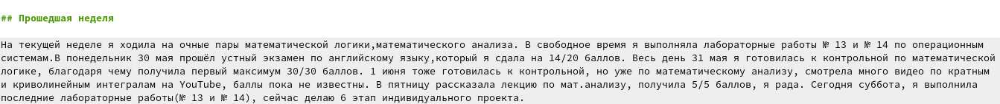{ #fig:001 width=70% }

Затем редактируем 10 пост(пост на тему по выбору)(рис.2).

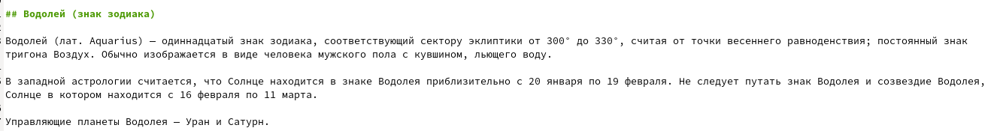{ #fig:002 width=70% }

2). Переходим в каталог work/blog/config/_default, там видим необходимый нам файл для редактирования: languages.yaml. Добавляем русский язык(рис.3).

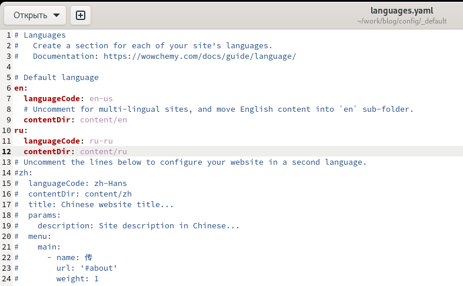{ #fig:003 width=70% }

В данном файле в поле contentDir мы прописали путь до папки с контентом(content) на соответствующем языке, поэтому в папке content необходимо создать папки с названиями, являющимися кодировкой языка(ru и en), и перенесём всё содержимое туда(рис.4).

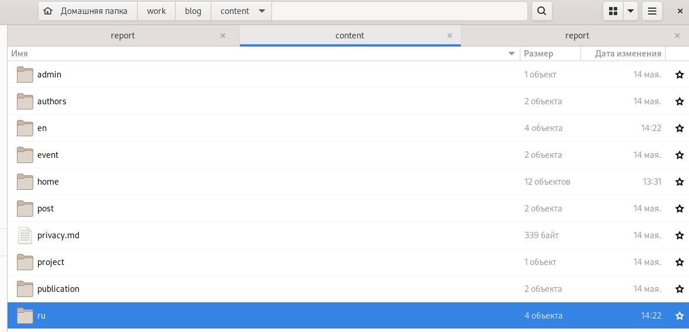{ #fig:004 width=70% }

В итоге у нас получатся 2 папки с одинаковым файловым содержимым. После этого отсаётся только перевести контент на новый язык.
3). Ввела в терминале в каталоге ~/work/blog команды для загрузки созданных файлов на GitHub(рис.5):
``` language
git add .
git commit -am "Поддержка двух языков"
git push origin main
```

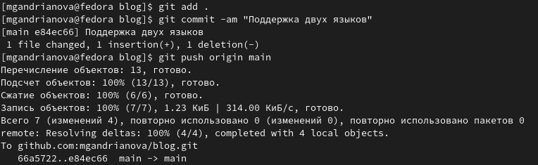{ #fig:005 width=70% }

Переходим в каталог public и повторяем предыдущее действие(рис.6):

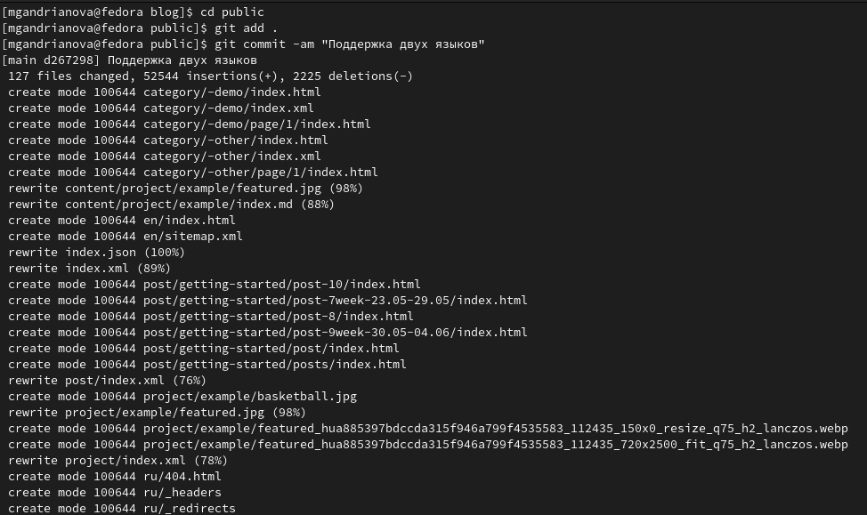{ #fig:006 width=70% }

Затем ввела команду "~/bin/hugo" и команду "~/bin/hugo server"(рис.7).

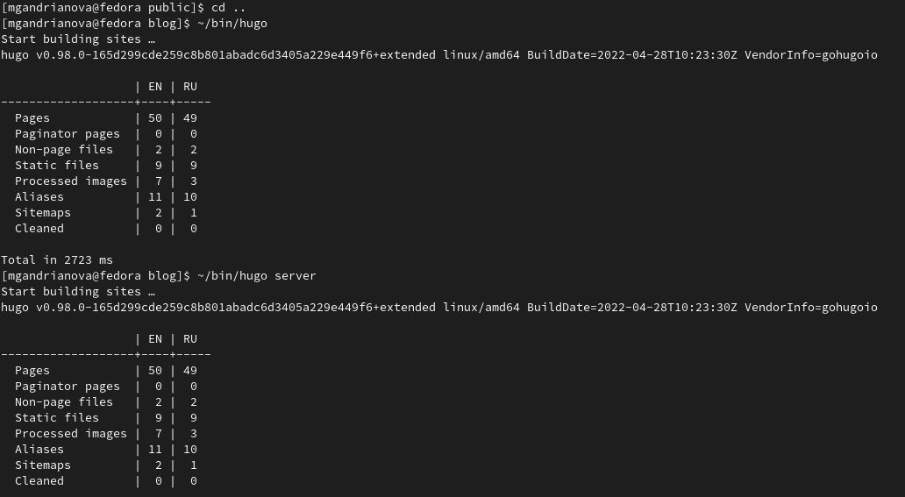{ #fig:007 width=70% }

Терминал выведет на экран ссылку нашего сайта: http://localhost:1313/ . Копируем её в браузер и переходим по ней(рис.8).

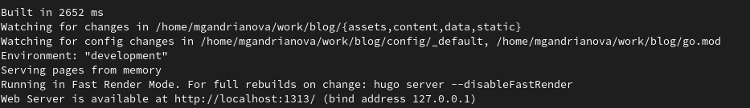{ #fig:008 width=70% }

4). Проверяем выполненные действия:
Сделала поддержку английского и русского языков:
2 поста на русском языке(рис.9).

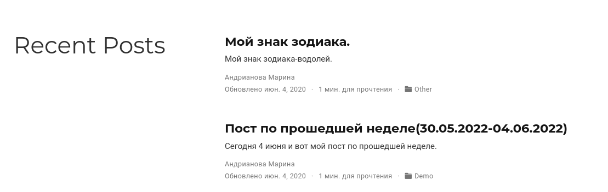{ #fig:009 width=70% }

2 поста на английском языке(рис.10).

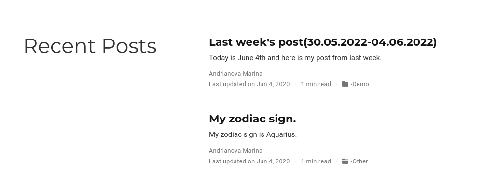{ #fig:010 width=70% }

Биография на русском языке(рис.11).

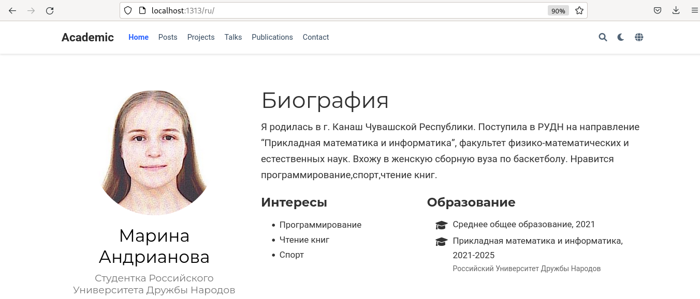{ #fig:011 width=70% }

Биография на английском языке(рис.12).

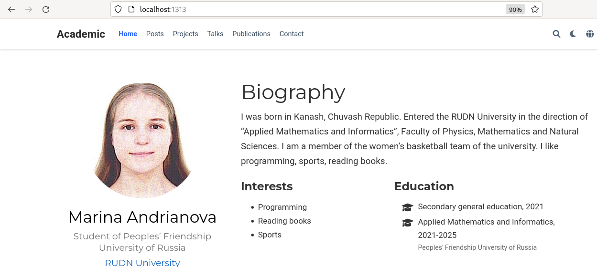{ #fig:012 width=70% }

# Выводы

Я сделала поддержку английского и русского языков, разместила элементы сайта на обоих языках, разместила контент на обоих языках, сделала пост по прошедшей неделе, добавила пост на тему по выбору (на двух языках).


